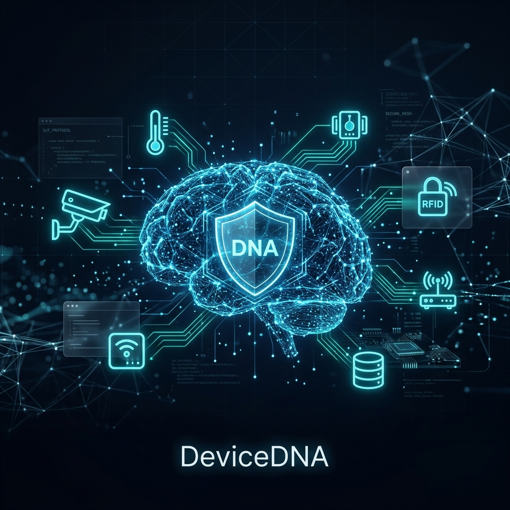
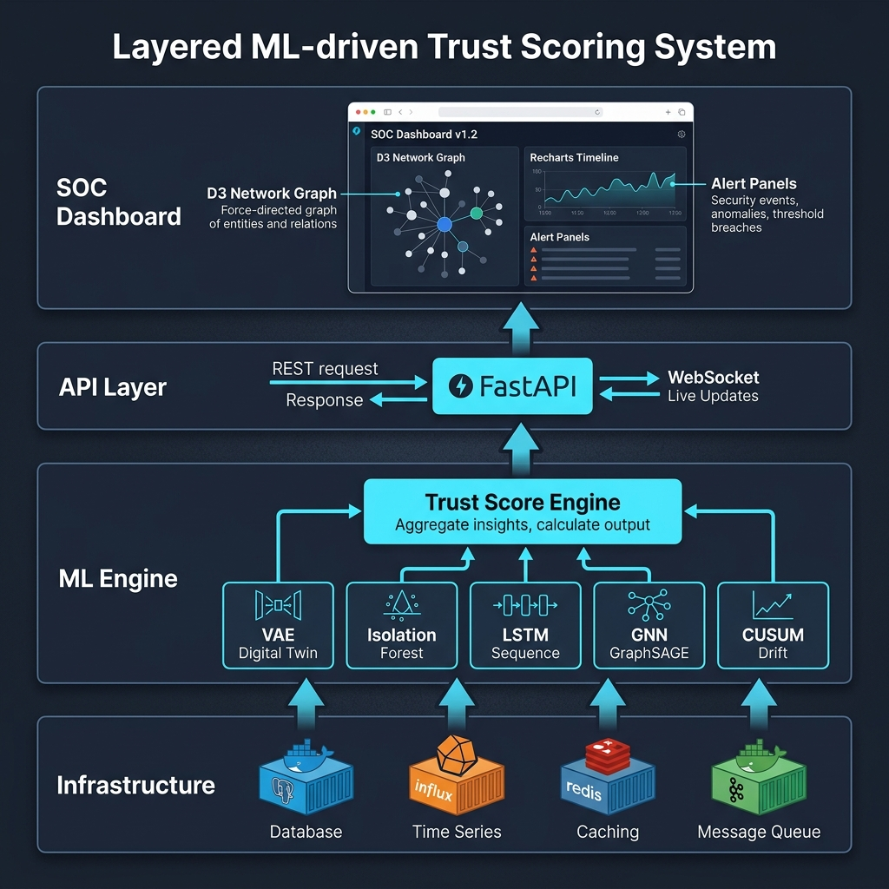

<p align="center">
  
</p>

<h1 align="center">DeviceDNA</h1>

<p align="center">
  <strong>AI-Powered Zero-Trust Security Platform for IoT Networks</strong>
</p>

<p align="center">
  <a href="#-quickstart"></a>
  <a href="#-architecture"></a>
  <a href="#-ml-pipeline"></a>
</p>

<p align="center">
  
  
  
  
  
  
  
</p>

---

## 📋 Table of Contents

- [Overview](#-overview)
- [Key Features](#-key-features)
- [Architecture](#-architecture)
- [ML Pipeline](#-ml-pipeline)
- [Tech Stack](#-tech-stack)
- [Project Structure](#-project-structure)
- [Quickstart](#-quickstart)
- [Training the Models](#-training-the-models)
- [Attack Simulation](#-attack-simulation)
- [API Reference](#-api-reference)
- [SOC Dashboard](#-soc-dashboard)
- [Roadmap](#-roadmap)
- [Contributing](#-contributing)
- [License](#-license)

---

## 🔍 Overview

**DeviceDNA** is a real-time cybersecurity platform that continuously monitors IoT network traffic and computes dynamic **Trust Scores** (0–100) for every device using a multi-model machine learning ensemble. Instead of relying on static firewall rules, DeviceDNA learns the unique behavioral fingerprint — the *Digital Twin* — of each device and detects deviations that indicate compromise.

> **The Problem:** IoT devices lack traditional endpoint security. Attackers exploit this by executing low-and-slow attacks — stealing kilobytes per day, drifting behavior gradually, or moving laterally across internal networks — all invisible to conventional rule-based systems.

> **The Solution:** DeviceDNA deploys 4 complementary ML architectures (VAE, Isolation Forest, LSTM, GNN) plus statistical drift detection (CUSUM) to catch every attack class — from hard anomalies to subtle behavioral drift — and presents actionable intelligence through a cinematic SOC dashboard.

### How It Works

```
IoT Devices → Kafka Stream → Feature Extraction → ML Ensemble → Trust Score → SOC Dashboard
     │              │               │                   │              │            │
  50 simulated   Raw network    14-dimensional      VAE + IF +      0-100       Real-time
   devices        flows         behavioral          LSTM + CUSUM    weighted     D3 network
                               feature vectors     scoring          composite    topology
```

---

## ✨ Key Features

| Feature | Description |
|---------|-------------|
| **Digital Twin Engine** | Per-device VAE autoencoders learn baseline behavioral distributions for 50 IoT devices |
| **5-Pillar Trust Scoring** | Weighted composite score combining Digital Twin (35%), Anomaly Ensemble (25%), Drift Intelligence (20%), Policy Conformance (15%), and Peer Comparison (5%) |
| **Multi-Model Ensemble** | Isolation Forest (hard anomalies) + LSTM (temporal sequences) + GNN/GraphSAGE (topological anomalies) |
| **CUSUM Drift Detection** | Statistical tracking of slow behavioral drift that evades point-in-time classifiers |
| **Kafka Streaming Pipeline** | High-throughput ingestion of network telemetry via Apache Kafka with async consumer |
| **Real-Time WebSocket Updates** | Socket.IO bridge pushes trust score changes to the dashboard instantly |
| **Cinematic SOC Dashboard** | Glassmorphic dark-themed UI with D3 force-directed network topology, Recharts timelines, and CUSUM heatmaps |
| **Attack Simulation Suite** | 4 distinct attack scenarios (Botnet C2, Slow Exfiltration, Lateral Movement, Policy Violation) |
| **Redis Score Cache** | Sub-millisecond trust score retrieval for dashboard rendering |

---

## 🏗 Architecture

<p align="center">
  
</p>

DeviceDNA follows a **four-layer architecture**:

### Layer 1 — Data Infrastructure (Docker)

| Service | Technology | Purpose |
|---------|-----------|---------|
| Stream Processing | Apache Kafka + Zookeeper | High-throughput telemetry ingestion from 50 devices |
| Score Cache | Redis 7 | Real-time trust score storage with TTL-based expiry |
| Time-Series DB | InfluxDB 2.7 | Historical telemetry and trust score persistence |
| Relational DB | PostgreSQL 16 | Device registry, policies, alerts, user accounts |

### Layer 2 — ML Engine (Python/PyTorch)

Five independent scoring modules feed into the weighted Trust Score Engine:

```
┌─────────────┐  ┌──────────────────┐  ┌──────────────┐  ┌──────────────┐  ┌────────────┐
│  VAE Twin   │  │ Isolation Forest │  │  LSTM Seq.   │  │ GNN GraphSAGE│  │   CUSUM    │
│  (per-device│  │  (per-class)     │  │  (shared)    │  │  (topology)  │  │  (drift)   │
│  .pt model) │  │  .joblib model   │  │  .pt model   │  │  (planned)   │  │  (online)  │
└──────┬──────┘  └────────┬─────────┘  └──────┬───────┘  └──────┬───────┘  └─────┬──────┘
       │ 35%              │ 10%               │ 10%             │ 5%             │ 20%
       └──────────────────┴───────────────────┴─────────────────┴─────────────────┘
                                              │
                                    ┌─────────▼──────────┐
                                    │  Trust Score Engine │
                                    │   (0 → 100 scale)  │
                                    └────────────────────┘
```

### Layer 3 — API Layer (FastAPI + Socket.IO)

Async Python backend wrapping ML inference behind REST endpoints and real-time WebSocket streams.

### Layer 4 — SOC Dashboard (Next.js 14)

Premium dark-themed command center with:
- **D3.js Force-Directed Network Topology** — 50-node interactive device map with trust-score coloring
- **Recharts Trust Timeline** — Live time-series with anomaly threshold markers
- **CUSUM Drift Heatmap** — 7-day × 24-hour calendar grid of behavioral drift intensity
- **Alert Management Panel** — Severity-filtered alert feed with device isolation controls

---

## 🧠 ML Pipeline

### Feature Extraction

Every telemetry window produces a **14-dimensional behavioral feature vector**:

| # | Feature | Description |
|---|---------|-------------|
| 0 | `total_flows` | Number of network flows in the window |
| 1 | `total_bytes` | Aggregate bytes transferred |
| 2 | `total_packets` | Aggregate packet count |
| 3 | `avg_packet_size` | Mean bytes per packet |
| 4 | `avg_duration_ms` | Mean flow duration |
| 5 | `tcp_ratio` | Proportion of TCP flows |
| 6 | `udp_ratio` | Proportion of UDP flows |
| 7 | `http_ratio` | Proportion of HTTP flows |
| 8 | `https_ratio` | Proportion of HTTPS flows |
| 9 | `dns_ratio` | Proportion of DNS flows |
| 10 | `other_protocol_ratio` | Proportion of other protocols |
| 11 | `unique_dst_ips` | Destination IP entropy |
| 12 | `unique_dst_ports` | Destination port entropy |
| 13 | `external_traffic_ratio` | Ratio of external-facing traffic |

### Model Architectures

#### 1. Variational Autoencoder (Digital Twin)

```
Input(14) → Linear(32) → ReLU → μ(16), σ(16) → Reparameterize → Linear(32) → ReLU → Output(14)
Loss: MSE + KL Divergence
```

- **Training**: One model per device (50 total), trained on synthetic baseline traffic
- **Inference**: Reconstruction error (MSE) normalized against empirical threshold → anomaly score [0, 1]
- **Detects**: Hard behavioral deviations from learned device identity

#### 2. Isolation Forest

- **Training**: One model per device class (6 total: camera, sensor, thermostat, access_control, medical, industrial)
- **Inference**: `decision_function()` inverted and normalized → anomaly score [0, 1]
- **Detects**: Statistical outliers in high-dimensional feature space

#### 3. LSTM Sequence Model

```
Input(seq_len, 14) → LSTM(hidden=64, layers=2) → Linear(14) → Predicted Next Vector
Loss: MSE(predicted, actual)
```

- **Training**: Single shared model across all device classes, trained on sliding windows of length 12
- **Inference**: Prediction error of next time step → anomaly score [0, 1]
- **Detects**: Temporal anomalies and slow behavioral drift over sequences

#### 4. GNN (GraphSAGE) — *Planned*

```
NodeFeatures(14) → SAGEConv(32) → ReLU → Dropout → SAGEConv(32) → ReLU → Linear(2) → Softmax
```

- **Purpose**: Detect topological anomalies (e.g., lateral movement) by modeling device communication graphs
- **Status**: Architecture defined, pending `torch-geometric` integration

#### 5. CUSUM Drift Engine

Online statistical method tracking cumulative Z-score deviations with configurable slack and threshold parameters. Catches gradual behavioral changes invisible to point-in-time classifiers.

---

## 🛠 Tech Stack

| Layer | Technology | Version |
|-------|-----------|---------|
| **Frontend** | Next.js (App Router) | 14.2 |
| **UI Framework** | React + TypeScript | 18.x |
| **Styling** | Tailwind CSS | 3.4 |
| **Visualizations** | D3.js, Recharts, Visx | 7.9, 3.7, 3.12 |
| **Animations** | Framer Motion | 12.x |
| **State** | Zustand | 5.0 |
| **WebSocket Client** | socket.io-client | 4.8 |
| **Backend** | FastAPI (ASGI) | 0.133 |
| **WebSocket Server** | python-socketio | 5.16 |
| **ML Framework** | PyTorch | 2.2 |
| **Classical ML** | scikit-learn | 1.4 |
| **Stream Processing** | Apache Kafka | 7.5 |
| **Cache** | Redis | 7.x |
| **Time-Series DB** | InfluxDB | 2.7 |
| **Relational DB** | PostgreSQL | 16 |
| **Containerization** | Docker Compose | 3.8 |

---

## 📁 Project Structure

```
DeviceDNA/
├── docker-compose.yml              # Infrastructure services (Kafka, Redis, Postgres, InfluxDB)
│
├── backend/
│   ├── app/
│   │   ├── main.py                 # FastAPI + Socket.IO ASGI entrypoint
│   │   ├── api/
│   │   │   ├── routes/
│   │   │   │   └── trust.py        # Trust score REST endpoints
│   │   │   └── ws.py               # Socket.IO WebSocket handlers
│   │   ├── db/
│   │   │   ├── influxdb.py         # InfluxDB client
│   │   │   ├── redis.py            # Redis client
│   │   │   └── postgres.py         # PostgreSQL connection (planned)
│   │   ├── ml/
│   │   │   ├── vae/
│   │   │   │   ├── model.py        # DeviceVAE architecture (14→32→16 latent)
│   │   │   │   └── scoring.py      # VAETwinScorer — per-device inference
│   │   │   ├── isolation_forest/
│   │   │   │   └── model.py        # IFAnomalyScorer — per-class inference
│   │   │   ├── lstm/
│   │   │   │   ├── model.py        # TimeSeriesLSTM architecture (14→64→14)
│   │   │   │   └── scoring.py      # LSTMScorer — sequence prediction
│   │   │   └── gnn/
│   │   │       └── model.py        # GraphSAGENetwork architecture
│   │   ├── schemas/
│   │   │   └── features.py         # FeatureVector Pydantic schema (14-dim)
│   │   └── services/
│   │       ├── trust_engine.py      # 5-Pillar TrustScoreEngine orchestrator
│   │       ├── telemetry.py         # Kafka consumer + WebSocket broadcaster
│   │       ├── feature_extraction.py# 14-dim feature vector computation
│   │       ├── drift_engine.py      # CUSUM statistical drift detector
│   │       └── dna_fingerprint.py   # 30-dim DNA cosine similarity service
│   ├── training/
│   │   ├── train_vae.py             # Train 50 per-device VAE Digital Twins
│   │   ├── train_isolation_forest.py# Train 6 per-class Isolation Forest models
│   │   └── train_lstm.py            # Train shared LSTM sequence predictor
│   ├── simulator/
│   │   ├── device_profiles.py       # 6 device classes, 50-device fleet generation
│   │   ├── traffic_generator.py     # Normal traffic flow synthesis
│   │   ├── attack_scenarios.py      # 4 attack scenario implementations
│   │   └── main.py                  # Kafka producer loop with attack injection
│   ├── models_trained/              # Trained model weights (.pt, .joblib, .json)
│   ├── db_init/
│   │   └── init.sql                 # PostgreSQL schema initialization
│   └── requirements.txt             # Python dependencies
│
├── frontend/
│   ├── app/
│   │   ├── page.tsx                 # Landing page (glassmorphic hero)
│   │   ├── layout.tsx               # Root layout
│   │   └── dashboard/
│   │       ├── page.tsx             # SOC Overview (KPIs, topology, timeline)
│   │       ├── layout.tsx           # Dashboard sidebar + header shell
│   │       ├── alerts/              # Alert management page
│   │       ├── topology/            # Full-screen D3 network map
│   │       ├── predict/             # Predictive risk (CUSUM + LSTM forecast)
│   │       ├── policies/            # NLP policy engine interface
│   │       ├── replay/              # Attack replay forensics
│   │       └── node/[id]/           # Device detail drill-down
│   ├── components/
│   │   ├── visualizations/
│   │   │   ├── NetworkTopologyMap.tsx  # D3 force-directed 50-node graph
│   │   │   ├── TrustScoreTimeline.tsx  # Recharts live trust timeline
│   │   │   └── DriftHeatmap.tsx        # 7×24 CUSUM drift calendar
│   │   ├── layout/                  # Sidebar, Header components
│   │   └── ui/                      # Shared UI primitives
│   ├── lib/                         # Utilities and API clients
│   └── store/                       # Zustand state management
│
└── docs/
    └── assets/                      # README images and diagrams
```

---

## 🚀 Quickstart

### Prerequisites

| Tool | Version | Purpose |
|------|---------|---------|
| [Docker Desktop](https://www.docker.com/products/docker-desktop/) | Latest | Infrastructure services |
| [Python](https://www.python.org/) | 3.12+ | Backend API and ML models |
| [Node.js](https://nodejs.org/) | 18+ | Frontend dashboard |

### 1. Clone the Repository

```bash
git clone https://github.com/karthik5033/DeviceDNA.git
cd DeviceDNA
```

### 2. Start Infrastructure Services

```bash
docker compose up -d
```

This boots up **PostgreSQL**, **InfluxDB**, **Redis**, **Kafka**, and **Zookeeper**.

### 3. Start the Backend API

```bash
cd backend
python -m venv venv

# Windows
.\venv\Scripts\activate

# macOS/Linux
source venv/bin/activate

pip install -r requirements.txt
uvicorn app.main:app --reload
```

The API will be available at `http://localhost:8000`. Verify with:

```bash
curl http://localhost:8000/api/health
# → {"status": "ok", "service": "DeviceDNA Backend"}
```

### 4. Start the Frontend Dashboard

```bash
cd frontend
npm install
npm run dev
```

### 5. Open the Dashboard

Navigate to **[http://localhost:3000/dashboard](http://localhost:3000/dashboard)** to access the SOC command center.

### 6. Start the Traffic Simulator *(Optional)*

In a separate terminal (with the backend venv activated):

```bash
cd backend
python -m simulator.main
```

This streams simulated IoT telemetry through Kafka and injects attack scenarios every 100 cycles.

---

## 🎓 Training the Models

All training scripts generate synthetic data from the device profiles — no external datasets required.

### Train VAE Digital Twins (50 models)

```bash
cd backend
python -m training.train_vae
```

Produces `models_trained/vae_SIM-XXXX.pt` + `vae_SIM-XXXX_norm.json` for each of the 50 devices.

### Train Isolation Forest (6 models)

```bash
python -m training.train_isolation_forest
```

Produces `models_trained/if_{class}.joblib` for each device class.

### Train LSTM Sequence Model (1 shared model)

```bash
python -m training.train_lstm
```

Produces `models_trained/lstm_shared.pt` + `lstm_shared_norm.json`.

---

## 🎯 Attack Simulation

The simulator implements **4 distinct attack scenarios** from the project's threat model:

| # | Scenario | Target | Technique | Primary Detector |
|---|----------|--------|-----------|-----------------|
| 1 | **Botnet C2 Beaconing** | Camera (SIM-0014) | Connections to 3 new external IPs on port 4444 | VAE + Isolation Forest |
| 2 | **Slow Data Exfiltration** | Sensor (SIM-0007) | Gradually increasing upload volume (5-8KB vs 500B baseline) | CUSUM Drift |
| 3 | **Lateral Movement** | Medical Devices | Internal SSH connections between devices with no prior edge | GNN (GraphSAGE) |
| 4 | **Policy Violation** | Thermostat | Connection to known TOR exit node | Policy Engine |

---

## 📡 API Reference

### Trust Score Endpoints

| Method | Endpoint | Description |
|--------|----------|-------------|
| `POST` | `/api/trust/evaluate` | Evaluate trust score for a device given current features |
| `GET` | `/api/trust/{device_id}/current` | Retrieve cached trust score from Redis |
| `GET` | `/api/health` | Service health check |

### WebSocket Events

| Event | Direction | Payload |
|-------|-----------|---------|
| `trust_update` | Server → Client | `{ device_id, score, timestamp }` |
| `new_alert` | Server → Client | `{ device_id, severity, message }` |
| `device_isolated` | Server → Client | `{ device_id, status }` |
| `isolate_device` | Client → Server | `{ device_id }` |

---

## 🖥 SOC Dashboard

The Security Operations Center dashboard provides 7 specialized views:

| Page | Route | Key Visualization |
|------|-------|-------------------|
| **SOC Overview** | `/dashboard` | KPI cards + D3 topology + trust timeline |
| **Network Topology** | `/dashboard/topology` | Full-screen force-directed device graph |
| **Alert Management** | `/dashboard/alerts` | Severity-filtered alert feed + device isolation |
| **Predictive Risk** | `/dashboard/predict` | CUSUM drift heatmap + LSTM forecast panel |
| **NLP Policies** | `/dashboard/policies` | Natural language policy authoring interface |
| **Attack Replay** | `/dashboard/replay` | Timeline scrub with forensic flow capture |
| **Device Detail** | `/dashboard/node/[id]` | Per-device trust breakdown and history |

---

## 🗺 Roadmap

- [x] Docker infrastructure (Kafka, Redis, PostgreSQL, InfluxDB)
- [x] 50-device telemetry simulator with 6 device classes
- [x] 4 attack scenario implementations
- [x] VAE Digital Twin — architecture, training, and live scoring
- [x] Isolation Forest — architecture, training, and live scoring
- [x] LSTM Sequence Model — architecture, training, and live scoring
- [x] CUSUM Drift Detection engine
- [x] 5-Pillar Trust Score Engine with weighted ensemble
- [x] Redis trust score caching and real-time retrieval
- [x] Kafka → Feature Extraction → ML → WebSocket pipeline
- [x] Cinematic SOC dashboard with D3 + Recharts + Framer Motion
- [ ] GNN (GraphSAGE) integration with PyTorch Geometric
- [ ] SHAP explainability for ML model outputs
- [ ] NLP Policy Engine (BERT-based natural language → firewall rules)
- [ ] InfluxDB historical trust score persistence
- [ ] Autonomous response engine (auto-isolate, sandbox, throttle)
- [ ] Attack replay backend with historical InfluxDB queries

---

## 🤝 Contributing

Contributions are welcome! Please feel free to submit a Pull Request.

1. Fork the repository
2. Create your feature branch (`git checkout -b feature/amazing-feature`)
3. Commit your changes (`git commit -m 'feat: add amazing feature'`)
4. Push to the branch (`git push origin feature/amazing-feature`)
5. Open a Pull Request

---

## 📄 License

This project is licensed under the MIT License. See the [LICENSE](LICENSE) file for details.

---

<p align="center">
  Built with 🔬 by <a href="https://github.com/karthik5033">Karthik K P</a>
</p>
