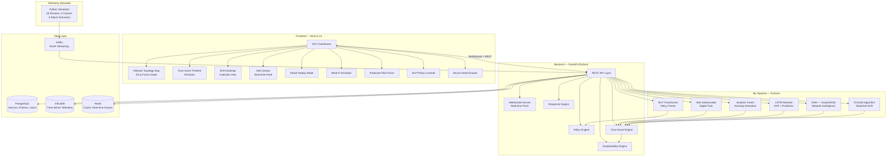
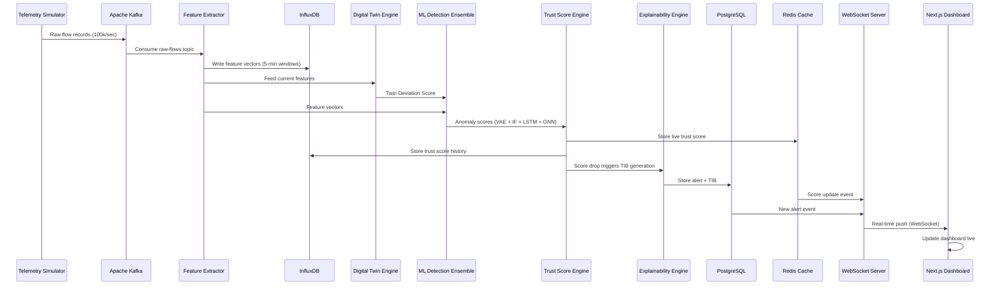

# DeviceDNA — Master Architecture & Build Flow Plan

> **Project**: DeviceDNA — AI-Powered IoT Cybersecurity Intelligence Platform  
> **Stack**: Next.js 14 (App Router) + Python/FastAPI + PyTorch + PostgreSQL + InfluxDB + Redis + Kafka  
> **GPU**: NVIDIA RTX 4060 (8GB VRAM — local model training)  
> **Created**: 2026-02-26

---

## 1. System Architecture Overview



---

## 2. Technology Stack — Final Decisions

| Layer | Technology | Justification |
|-------|-----------|---------------|
| **Frontend Framework** | Next.js 14 (App Router) | SSR, API routes, React Server Components |
| **UI Library** | shadcn/ui + Radix Primitives | Production-grade, accessible, customizable |
| **Styling** | Tailwind CSS v3 | Rapid UI development, design tokens |
| **Data Visualization** | D3.js + Recharts + Visx | Network graphs (D3), charts (Recharts), heatmaps (Visx) |
| **Real-time** | Socket.IO (client) | WebSocket with fallback |
| **State Management** | Zustand + React Query (TanStack) | Server state (React Query), client state (Zustand) |
| **Backend Framework** | FastAPI (Python 3.11+) | Async, auto-docs, ML ecosystem native |
| **ML Framework** | PyTorch 2.x + PyTorch Geometric | VAE, LSTM, GNN training on RTX 4060 |
| **Statistical ML** | scikit-learn | Isolation Forest, CUSUM |
| **Explainability** | SHAP | Feature attribution for all models |
| **NLP** | Hugging Face Transformers (BERT-base) | Policy parsing fine-tuning |
| **Time-Series DB** | InfluxDB 2.x | Telemetry storage, fast range queries |
| **Relational DB** | PostgreSQL 16 | Devices, policies, users, alerts |
| **Cache / Pub-Sub** | Redis 7 | Live trust scores, session cache |
| **Message Queue** | Apache Kafka (via Docker) | Telemetry streaming pipeline |
| **Containerization** | Docker + Docker Compose | Full-stack orchestration |
| **Task Queue** | Celery + Redis (broker) | Async ML inference jobs |

---

## 3. Phased Build Order

> [!IMPORTANT]
> This is a **big** project. We build it **layer by layer**, never jumping ahead. Each phase produces a working, testable increment.

### Phase 0 — Project Scaffolding & Infrastructure (Day 1)
**Goal**: Both apps running, databases connected, Docker Compose up.

| # | Task | Details |
|---|------|---------|
| 0.1 | Initialize Next.js 14 app | App Router, TypeScript, Tailwind, ESLint |
| 0.2 | Initialize FastAPI backend | Project structure, virtual env, uvicorn |
| 0.3 | Docker Compose file | PostgreSQL, InfluxDB, Redis, Kafka, Zookeeper |
| 0.4 | Database schemas | PostgreSQL: devices, policies, alerts, trust_scores, users |
| 0.5 | Basic API health checks | `/api/health` on both frontend and backend |
| 0.6 | Environment config | `.env` files, config management |
| 0.7 | CORS + proxy setup | Next.js → FastAPI proxy for API calls |

**Deliverable**: `docker-compose up` starts everything. Frontend shows "DeviceDNA" landing page. Backend returns health check.

---

### Phase 1 — Telemetry Simulator & Data Pipeline (Day 2–3)
**Goal**: Simulated IoT network generating realistic data flowing through Kafka into InfluxDB.

| # | Task | Details |
|---|------|---------|
| 1.1 | Device class definitions | 6 classes: Camera, Sensor, Thermostat, Access Control, Medical, Industrial |
| 1.2 | Simulated device fleet | 50 devices with unique IDs, MACs, types, VLANs |
| 1.3 | Normal traffic generator | Per-class behavioral profiles (ports, protocols, packet sizes, frequencies) |
| 1.4 | Kafka producer | Publish flow records to `raw-flows` topic |
| 1.5 | Kafka consumer + InfluxDB writer | Consume flows, normalize, write to InfluxDB |
| 1.6 | Feature extraction engine | 5-min rolling windows → device feature vectors |
| 1.7 | Feature vector storage | Write feature vectors to InfluxDB `device_features` measurement |
| 1.8 | 4 attack scenario injectors | C2 Beaconing, Slow Exfil, Lateral Movement, NLP Trigger |

**Deliverable**: Simulator runs continuously. Feature vectors accumulate in InfluxDB. Can query last N minutes of any device's features.

---

### Phase 2 — Digital Twin & DNA Fingerprinting (Day 4–6)
**Goal**: Every device has a trained behavioral model (Digital Twin) and a persistent DNA fingerprint.

| # | Task | Details |
|---|------|---------|
| 2.1 | VAE Autoencoder architecture | PyTorch model for learning normal feature space |
| 2.2 | Baseline data collection | 7-day simulated baseline (accelerated to minutes for dev) |
| 2.3 | Per-device twin training | Train VAE on each device's baseline features |
| 2.4 | Twin deviation scoring | Reconstruction error → Twin Deviation Score (0.0–1.0) |
| 2.5 | DNA fingerprint computation | Compressed behavioral vector from baseline stats |
| 2.6 | Device classification via DNA | Cosine similarity to class-average DNAs |
| 2.7 | Compromise detection | Current DNA vs enrolled DNA cosine similarity monitoring |
| 2.8 | Model persistence | Save/load trained models per device (PyTorch `.pt` files) |

**Deliverable**: Each device has a trained Digital Twin. New feature vectors produce deviation scores. DNA fingerprints classify unknown devices.

---

### Phase 3 — ML Detection Ensemble & Trust Score Engine (Day 7–10)
**Goal**: Full anomaly detection pipeline producing live trust scores.

| # | Task | Details |
|---|------|---------|
| 3.1 | Isolation Forest training | scikit-learn, per-device-class, on baseline data |
| 3.2 | LSTM time-series model | PyTorch LSTM for temporal anomaly patterns |
| 3.3 | GNN (GraphSAGE) setup | PyTorch Geometric, communication graph modeling |
| 3.4 | GNN training on baseline topology | Normal graph structure learning |
| 3.5 | Ensemble scoring | Weighted combination: VAE(0.35) + IF(0.25) + LSTM(0.25) + GNN(0.15) |
| 3.6 | Trust Score Engine | 5-pillar weighted scoring → 0–100 score |
| 3.7 | Trust score persistence | Write scores to InfluxDB time-series + Redis cache |
| 3.8 | CUSUM drift detection | Per-feature cumulative sum tracking |
| 3.9 | Hard drift detection | Binary rule violation checker |
| 3.10 | API endpoints | `GET /devices/{id}/trust-score`, `GET /devices/{id}/anomaly-scores` |

**Deliverable**: Every device has a live, updating trust score. Anomaly detection fires on injected attacks. Drift detection catches slow exfil scenario.

---

### Phase 4 — Explainability Engine (Day 11–12)
**Goal**: Every alert accompanied by a human-readable Threat Intelligence Brief (TIB).

| # | Task | Details |
|---|------|---------|
| 4.1 | SHAP integration | Compute SHAP values for IF and VAE model outputs |
| 4.2 | Feature-to-language mapping | 120-entry lookup: (feature, direction, severity) → NL template |
| 4.3 | TIB generator | Assemble headline, evidence items, context, recommendations |
| 4.4 | Confidence scoring | Model agreement percentage → confidence level |
| 4.5 | Alert creation pipeline | Trust score drop triggers → alert + TIB stored in PostgreSQL |
| 4.6 | API endpoints | `GET /alerts`, `GET /alerts/{id}/brief`, `GET /devices/{id}/alerts` |

**Deliverable**: Alerts auto-generated with full TIBs. Each brief has headline, evidence, context, and recommended actions.

---

### Phase 5 — SOC Dashboard Frontend (Day 13–18)
**Goal**: Full SOC-grade visualization dashboard — the face of DeviceDNA.

| # | Task | Details |
|---|------|---------|
| 5.1 | Dashboard layout & navigation | Sidebar, header, main content, dark theme |
| 5.2 | Network topology map (D3.js) | Force-directed graph, trust-score colored nodes, click-to-drill |
| 5.3 | Trust score timeline (Recharts) | Per-device line chart, threshold lines, multi-device overlay |
| 5.4 | Drift heatmap (Visx) | Calendar-style, color intensity = drift magnitude |
| 5.5 | Alert queue panel | Priority-sorted, severity badges, expandable TIBs |
| 5.6 | Device detail drawer | Full device profile, DNA fingerprint, trust history, active policies |
| 5.7 | WebSocket integration | Real-time trust score updates, new alert notifications |
| 5.8 | Predictive risk panel | Top-N at-risk devices, LSTM forecast charts |
| 5.9 | Responsive design | Desktop-first (1920px) with tablet support |
| 5.10 | Loading states & animations | Skeleton screens, micro-animations, transitions |

**Deliverable**: Fully interactive SOC dashboard showing live network state, trust scores, alerts, and drill-down capabilities.

---

### Phase 6 — NLP Policy Engine & Advanced Features (Day 19–22)
**Goal**: Natural language policy creation, attack replay, what-if simulator.

| # | Task | Details |
|---|------|---------|
| 6.1 | BERT-based policy parser | Fine-tune on synthetic policy statement dataset |
| 6.2 | Intent classification | Detect: alert, isolate, flag, notify, block, throttle |
| 6.3 | Entity extraction | Device types, ports, protocols, IPs, time ranges, thresholds |
| 6.4 | Rule generation engine | NLP output → structured policy object |
| 6.5 | Policy review UI | Show generated rule for human approval |
| 6.6 | Policy evaluation integration | New policies feed into policy evaluation cycle |
| 6.7 | Attack replay mode | Time-slider replay of network graph evolution during incidents |
| 6.8 | What-if simulator | "What if we isolate Device X?" → predicted trust score impacts |
| 6.9 | Predictive risk forecasting UI | LSTM 24–48 hour forecasts with confidence intervals |

**Deliverable**: SOC analyst can type natural language policy, review generated rule, activate it. Attack replay and what-if simulation working.

---

### Phase 7 — Autonomous Response & Honey-Patch Sandbox (Day 23–25)
**Goal**: Automated containment, sandboxing, and response actions.

| # | Task | Details |
|---|------|---------|
| 7.1 | Response action library | Isolate, sandbox, throttle, quarantine, full block |
| 7.2 | Autonomous response rules | Trust score thresholds → automatic actions |
| 7.3 | Honey-Patch sandbox (simulated) | Traffic mirroring simulation, forensic capture |
| 7.4 | Response audit log | Every action logged with timestamp, trigger, result |
| 7.5 | Manual response controls | Dashboard buttons for SOC operator manual actions |
| 7.6 | Response mode toggle | Advisory / Semi-Auto / Full Autonomous |
| 7.7 | Integration testing | End-to-end: attack → detection → scoring → alert → response |

**Deliverable**: Full autonomous response pipeline. Attack injection triggers detection, scoring, alerting, and containment automatically.

---

### Phase 8 — Polish, Demo & Deployment (Day 26–28)
**Goal**: Production-ready demo environment.

| # | Task | Details |
|---|------|---------|
| 8.1 | Demo script implementation | 5-minute scripted demo flow per PRD Section 13.2 |
| 8.2 | Performance optimization | Frontend bundle size, API response times, ML inference speed |
| 8.3 | Error handling & resilience | Graceful degradation, retry logic, error boundaries |
| 8.4 | Docker Compose finalization | Single `docker-compose up` deploys everything |
| 8.5 | Pre-loaded demo data | 7-day baseline history for 50 devices pre-computed |
| 8.6 | Documentation | README, API docs (auto-generated via FastAPI), architecture diagram |
| 8.7 | Video recording | Demo walkthrough recording |

**Deliverable**: `docker-compose up` → full platform running → 5-minute demo script executable.

---

## 4. Data Flow Architecture



---

## 5. Directory Structure

```
DeviceDNA/
├── frontend/                    # Next.js 14 App
│   ├── app/                     # App Router pages
│   │   ├── layout.tsx           # Root layout (dark theme, fonts)
│   │   ├── page.tsx             # Landing / login
│   │   ├── dashboard/
│   │   │   ├── page.tsx         # Main SOC dashboard
│   │   │   ├── topology/        # Network topology map
│   │   │   ├── devices/         # Device list + detail
│   │   │   ├── alerts/          # Alert queue
│   │   │   ├── policies/        # Policy management + NLP
│   │   │   ├── replay/          # Attack replay mode
│   │   │   └── simulator/       # What-if simulator
│   │   └── api/                 # Next.js API routes (proxy)
│   ├── components/
│   │   ├── ui/                  # shadcn/ui components
│   │   ├── dashboard/           # Dashboard-specific components
│   │   ├── visualizations/      # D3, Recharts, Visx wrappers
│   │   └── layout/              # Navigation, sidebar, header
│   ├── lib/
│   │   ├── api.ts               # Backend API client
│   │   ├── websocket.ts         # Socket.IO client
│   │   ├── store.ts             # Zustand stores
│   │   └── utils.ts             # Shared utilities
│   ├── hooks/                   # Custom React hooks
│   ├── types/                   # TypeScript type definitions
│   └── public/                  # Static assets
│
├── backend/                     # FastAPI Python Backend
│   ├── app/
│   │   ├── main.py              # FastAPI app entry point
│   │   ├── config.py            # Settings & environment
│   │   ├── api/
│   │   │   ├── routes/
│   │   │   │   ├── devices.py   # Device CRUD + status
│   │   │   │   ├── alerts.py    # Alert endpoints
│   │   │   │   ├── policies.py  # Policy CRUD + NLP
│   │   │   │   ├── trust.py     # Trust score queries
│   │   │   │   ├── response.py  # Response action triggers
│   │   │   │   ├── replay.py    # Attack replay data
│   │   │   │   └── simulator.py # What-if simulation
│   │   │   └── websocket.py     # WebSocket handler
│   │   ├── models/              # SQLAlchemy ORM models
│   │   ├── schemas/             # Pydantic request/response schemas
│   │   ├── services/
│   │   │   ├── telemetry.py     # Telemetry processing
│   │   │   ├── feature_extraction.py
│   │   │   ├── trust_engine.py  # Trust score computation
│   │   │   ├── policy_engine.py # Policy evaluation
│   │   │   ├── drift_engine.py  # CUSUM + hard drift
│   │   │   ├── explainability.py # SHAP + TIB generation
│   │   │   ├── response_engine.py # Autonomous response
│   │   │   └── sandbox.py       # Honey-patch sandbox
│   │   ├── ml/
│   │   │   ├── vae/             # VAE autoencoder (Digital Twin)
│   │   │   ├── isolation_forest/ # Isolation Forest model
│   │   │   ├── lstm/            # LSTM time-series model
│   │   │   ├── gnn/             # GraphSAGE GNN model
│   │   │   ├── nlp/             # BERT policy parser
│   │   │   └── ensemble.py      # Weighted ensemble scoring
│   │   └── db/
│   │       ├── postgres.py      # PostgreSQL connection
│   │       ├── influxdb.py      # InfluxDB client
│   │       └── redis.py         # Redis client
│   ├── simulator/
│   │   ├── device_profiles.py   # Device class behavioral profiles
│   │   ├── traffic_generator.py # Normal traffic generation
│   │   ├── attack_scenarios.py  # 4 attack injectors
│   │   └── kafka_producer.py    # Publish to Kafka
│   ├── training/
│   │   ├── train_vae.py         # Digital Twin VAE training script
│   │   ├── train_lstm.py        # LSTM training script
│   │   ├── train_gnn.py         # GNN training script
│   │   ├── train_nlp.py         # NLP policy parser fine-tuning
│   │   └── train_isolation_forest.py
│   ├── models_trained/          # Saved model weights (.pt files)
│   ├── requirements.txt
│   └── Dockerfile
│
├── docker-compose.yml           # Full stack orchestration
├── .env                         # Environment variables
├── .env.example
├── README.md
└── docs/
    ├── architecture.md
    ├── api-reference.md
    └── demo-script.md
```

---

## 6. RTX 4060 Training Plan

> [!TIP]
> Your RTX 4060 has 8GB VRAM — more than enough for all models in this project. Here's the GPU utilization plan.

| Model | Framework | Est. VRAM Usage | Training Time (est.) | Notes |
|-------|-----------|----------------|---------------------|-------|
| VAE Autoencoder | PyTorch | ~1.5 GB | ~15 min per device class | Small latent space (32-dim), lightweight |
| LSTM (Prediction) | PyTorch | ~2 GB | ~30 min per device | 2-layer LSTM, hidden_size=128 |
| GNN (GraphSAGE) | PyTorch Geometric | ~3 GB | ~45 min | 50-node graph, 2 SAGEConv layers |
| BERT (NLP Policy) | Hugging Face | ~4 GB | ~1-2 hours | Fine-tune bert-base-uncased on synthetic data |
| Isolation Forest | scikit-learn | CPU only | ~2 min | No GPU needed |
| CUSUM | NumPy | CPU only | Instant | Statistical, no training |

> **Total sequential training time**: ~3-4 hours. Models can be trained once and persisted.

---

## 7. Build Rules

> [!CAUTION]
> Follow these rules strictly to avoid architecture debt.

1. **Never skip a phase** — Each phase depends on the previous one
2. **Test each layer independently** — Backend APIs tested before frontend integrates them
3. **Simulate before real** — Always use simulated telemetry; real network taps come later
4. **Model training is offline** — Train models in `training/` scripts, load in services
5. **Type everything** — TypeScript on frontend, Pydantic schemas on backend
6. **Real-time is a feature, not a bug** — WebSocket infrastructure built early, used everywhere
7. **Explainability is not optional** — Every score, every alert, every action has a "why"

---

## 8. What We Build First

> [!IMPORTANT]
> **We start with Phase 0 — Project Scaffolding.** The first session will:
> 1. Initialize the Next.js 14 frontend
> 2. Initialize the FastAPI backend
> 3. Create the Docker Compose file
> 4. Set up database schemas
> 5. Verify both apps run and can communicate

**Ready to begin Phase 0? Say the word.**
