# DeviceDNA — Backend Implementation Plan

> **Framework**: FastAPI (Python 3.11+)  
> **ML**: PyTorch 2.x + PyTorch Geometric + scikit-learn  
> **Databases**: PostgreSQL 16 + InfluxDB 2.x + Redis 7  
> **Streaming**: Apache Kafka  
> **GPU**: NVIDIA RTX 4060 (8GB VRAM)

---

## 1. Backend Architecture Overview

```mermaid
graph TB
    subgraph "API Layer"
        A[FastAPI Server<br/>uvicorn + gunicorn]
        B[WebSocket Server<br/>Socket.IO / FastAPI WS]
    end

    subgraph "Service Layer"
        C[TelemetryService]
        D[FeatureExtractionService]
        E[TrustScoreEngine]
        F[PolicyEngine]
        G[DriftEngine]
        H[ExplainabilityEngine]
        I[ResponseEngine]
        J[SandboxService]
        K[PredictionService]
        L[ReplayService]
    end

    subgraph "ML Layer"
        M[VAE Model<br/>Digital Twin]
        N[Isolation Forest<br/>Anomaly Detection]
        O[LSTM Model<br/>Time-Series]
        P[GNN Model<br/>GraphSAGE]
        Q[BERT Model<br/>NLP Policy]
        R[CUSUM Algorithm<br/>Statistical Drift]
        S[Ensemble Scorer<br/>Weighted Combination]
    end

    subgraph "Data Layer"
        T[(PostgreSQL)]
        U[(InfluxDB)]
        V[(Redis)]
        W[Kafka]
    end

    subgraph "Workers"
        X[Celery Workers<br/>Async ML Inference]
        Y[Kafka Consumers<br/>Stream Processing]
    end

    A --> C & D & E & F & G & H & I & J & K & L
    B --> V
    E --> M & N & O & P & R & S
    F --> Q
    H --> M & N
    X --> M & N & O & P & Q
    Y --> C & D
    C & D --> U
    E & F & H --> T
    E --> V
    C --> W
```



---

## 2. Database Schemas

### 2.1 PostgreSQL Schema

```sql
-- ============================================
-- DEVICES
-- ============================================
CREATE TABLE devices (
    id UUID PRIMARY KEY DEFAULT gen_random_uuid(),
    name VARCHAR(100) NOT NULL,
    mac_address VARCHAR(17) UNIQUE NOT NULL,
    ip_address INET NOT NULL,
    device_class VARCHAR(30) NOT NULL CHECK (
        device_class IN ('camera', 'sensor', 'thermostat', 
                          'access_control', 'medical', 'industrial')
    ),
    vlan INTEGER NOT NULL,
    status VARCHAR(20) NOT NULL DEFAULT 'online' CHECK (
        status IN ('online', 'offline', 'sandboxed', 'isolated', 'quarantined')
    ),
    firmware_version VARCHAR(50),
    manufacturer VARCHAR(100),
    baseline_complete BOOLEAN DEFAULT FALSE,
    baseline_started_at TIMESTAMPTZ,
    baseline_completed_at TIMESTAMPTZ,
    enrolled_at TIMESTAMPTZ DEFAULT NOW(),
    last_seen_at TIMESTAMPTZ DEFAULT NOW(),
    metadata JSONB DEFAULT '{}',
    created_at TIMESTAMPTZ DEFAULT NOW(),
    updated_at TIMESTAMPTZ DEFAULT NOW()
);

CREATE INDEX idx_devices_class ON devices(device_class);
CREATE INDEX idx_devices_status ON devices(status);
CREATE INDEX idx_devices_vlan ON devices(vlan);

-- ============================================
-- DNA FINGERPRINTS
-- ============================================
CREATE TABLE dna_fingerprints (
    id UUID PRIMARY KEY DEFAULT gen_random_uuid(),
    device_id UUID NOT NULL REFERENCES devices(id),
    fingerprint_vector FLOAT8[] NOT NULL,       -- High-dimensional behavioral vector
    avg_traffic_volume FLOAT8 NOT NULL,
    packet_timing_regularity FLOAT8 NOT NULL,
    protocol_mix JSONB NOT NULL,                -- {TCP: 0.6, UDP: 0.3, ICMP: 0.1}
    external_ip_entropy FLOAT8 NOT NULL,
    communication_degree FLOAT8 NOT NULL,
    cosine_similarity_to_class FLOAT8,          -- Similarity to class-average DNA
    enrolled_at TIMESTAMPTZ DEFAULT NOW(),
    is_baseline BOOLEAN DEFAULT TRUE,           -- FALSE for current/comparison DNAs
    created_at TIMESTAMPTZ DEFAULT NOW()
);

CREATE INDEX idx_dna_device ON dna_fingerprints(device_id);

-- ============================================
-- TRUST SCORES (snapshot per evaluation cycle)
-- ============================================
CREATE TABLE trust_scores (
    id UUID PRIMARY KEY DEFAULT gen_random_uuid(),
    device_id UUID NOT NULL REFERENCES devices(id),
    score INTEGER NOT NULL CHECK (score >= 0 AND score <= 100),
    level VARCHAR(20) NOT NULL CHECK (
        level IN ('trusted', 'normal', 'guarded', 'suspicious', 'critical')
    ),
    -- 5 Pillar Scores (each 0.0 – 1.0, lower = better)
    pillar_twin_deviation FLOAT8 NOT NULL,
    pillar_ml_anomaly FLOAT8 NOT NULL,
    pillar_policy_conformance FLOAT8 NOT NULL,
    pillar_peer_comparison FLOAT8 NOT NULL,
    pillar_threat_intel FLOAT8 NOT NULL,
    -- Trend
    trend VARCHAR(10) CHECK (trend IN ('improving', 'stable', 'degrading')),
    evaluated_at TIMESTAMPTZ DEFAULT NOW()
);

CREATE INDEX idx_trust_device_time ON trust_scores(device_id, evaluated_at DESC);

-- ============================================
-- ALERTS
-- ============================================
CREATE TABLE alerts (
    id UUID PRIMARY KEY DEFAULT gen_random_uuid(),
    device_id UUID NOT NULL REFERENCES devices(id),
    severity VARCHAR(10) NOT NULL CHECK (
        severity IN ('critical', 'high', 'medium', 'low')
    ),
    alert_type VARCHAR(30) NOT NULL CHECK (
        alert_type IN ('hard_drift', 'soft_drift', 'anomaly', 
                        'policy_violation', 'gnn_cluster', 'prediction',
                        'dna_divergence', 'baseline_poisoning')
    ),
    headline TEXT NOT NULL,
    status VARCHAR(20) NOT NULL DEFAULT 'active' CHECK (
        status IN ('active', 'investigating', 'dismissed', 'resolved', 'escalated')
    ),
    confidence FLOAT8 NOT NULL CHECK (confidence >= 0 AND confidence <= 1),
    -- Threat Intelligence Brief (embedded JSONB)
    brief JSONB,
    -- SHAP attributions
    shap_values JSONB,
    -- Response action taken (if any)
    response_action VARCHAR(30),
    response_at TIMESTAMPTZ,
    -- Metadata
    dismissed_by VARCHAR(100),
    dismissed_reason TEXT,
    created_at TIMESTAMPTZ DEFAULT NOW(),
    updated_at TIMESTAMPTZ DEFAULT NOW()
);

CREATE INDEX idx_alerts_device ON alerts(device_id);
CREATE INDEX idx_alerts_severity ON alerts(severity);
CREATE INDEX idx_alerts_status ON alerts(status);
CREATE INDEX idx_alerts_created ON alerts(created_at DESC);

-- ============================================
-- POLICIES
-- ============================================
CREATE TABLE policies (
    id UUID PRIMARY KEY DEFAULT gen_random_uuid(),
    tier INTEGER NOT NULL CHECK (tier IN (1, 2, 3)),
    name VARCHAR(200) NOT NULL,
    description TEXT,
    natural_language TEXT,              -- Original NLP input (if NLP-generated)
    rule_definition JSONB NOT NULL,     -- Structured rule object
    severity_on_violation VARCHAR(10) DEFAULT 'medium',
    target_device_class VARCHAR(30),   -- NULL = all classes (Tier 1)
    target_device_id UUID REFERENCES devices(id), -- NULL = all in class (Tier 1/2)
    status VARCHAR(20) NOT NULL DEFAULT 'active' CHECK (
        status IN ('active', 'inactive', 'pending_review', 'archived')
    ),
    nlp_confidence FLOAT8,             -- NLP parsing confidence (if NLP-generated)
    created_by VARCHAR(100) NOT NULL DEFAULT 'system',
    created_at TIMESTAMPTZ DEFAULT NOW(),
    updated_at TIMESTAMPTZ DEFAULT NOW()
);

CREATE INDEX idx_policies_tier ON policies(tier);
CREATE INDEX idx_policies_status ON policies(status);

-- ============================================
-- POLICY VIOLATIONS
-- ============================================
CREATE TABLE policy_violations (
    id UUID PRIMARY KEY DEFAULT gen_random_uuid(),
    device_id UUID NOT NULL REFERENCES devices(id),
    policy_id UUID NOT NULL REFERENCES policies(id),
    alert_id UUID REFERENCES alerts(id),
    violation_type VARCHAR(10) NOT NULL CHECK (
        violation_type IN ('hard', 'soft')
    ),
    violated_feature VARCHAR(100) NOT NULL,
    current_value FLOAT8,
    threshold_value FLOAT8,
    details JSONB,
    detected_at TIMESTAMPTZ DEFAULT NOW()
);

-- ============================================
-- RESPONSE ACTIONS (audit log)
-- ============================================
CREATE TABLE response_actions (
    id UUID PRIMARY KEY DEFAULT gen_random_uuid(),
    device_id UUID NOT NULL REFERENCES devices(id),
    alert_id UUID REFERENCES alerts(id),
    action VARCHAR(30) NOT NULL CHECK (
        action IN ('isolate', 'sandbox', 'throttle', 'quarantine', 
                   'full_block', 'restore', 'manual_review')
    ),
    trigger_type VARCHAR(20) NOT NULL CHECK (
        trigger_type IN ('autonomous', 'semi_auto', 'manual')
    ),
    trigger_reason TEXT NOT NULL,
    trust_score_at_trigger INTEGER,
    result VARCHAR(20) CHECK (result IN ('success', 'failed', 'pending', 'rolled_back')),
    result_details JSONB,
    executed_at TIMESTAMPTZ DEFAULT NOW(),
    rolled_back_at TIMESTAMPTZ,
    executed_by VARCHAR(100)  -- 'system' or username
);

CREATE INDEX idx_response_device ON response_actions(device_id);

-- ============================================
-- DRIFT TRACKING
-- ============================================
CREATE TABLE drift_records (
    id UUID PRIMARY KEY DEFAULT gen_random_uuid(),
    device_id UUID NOT NULL REFERENCES devices(id),
    drift_type VARCHAR(10) NOT NULL CHECK (drift_type IN ('hard', 'soft')),
    feature_name VARCHAR(100) NOT NULL,
    cusum_value FLOAT8,                -- Current CUSUM accumulation
    cusum_threshold FLOAT8,            -- Threshold that was crossed
    drift_direction VARCHAR(10),       -- 'increase' or 'decrease'
    drift_rate FLOAT8,                 -- Rate of change per day
    drift_start_at TIMESTAMPTZ,
    baseline_mean FLOAT8,
    current_mean FLOAT8,
    detected_at TIMESTAMPTZ DEFAULT NOW()
);

CREATE INDEX idx_drift_device ON drift_records(device_id);

-- ============================================
-- USERS (SOC Analysts)
-- ============================================
CREATE TABLE users (
    id UUID PRIMARY KEY DEFAULT gen_random_uuid(),
    username VARCHAR(50) UNIQUE NOT NULL,
    email VARCHAR(100) UNIQUE NOT NULL,
    password_hash VARCHAR(255) NOT NULL,
    role VARCHAR(20) NOT NULL DEFAULT 'analyst' CHECK (
        role IN ('admin', 'analyst', 'viewer')
    ),
    created_at TIMESTAMPTZ DEFAULT NOW()
);

-- ============================================
-- PLATFORM SETTINGS
-- ============================================
CREATE TABLE platform_settings (
    key VARCHAR(100) PRIMARY KEY,
    value JSONB NOT NULL,
    updated_at TIMESTAMPTZ DEFAULT NOW(),
    updated_by VARCHAR(100)
);

INSERT INTO platform_settings (key, value) VALUES
    ('response_mode', '"advisory"'),
    ('trust_thresholds', '{"critical": 20, "suspicious": 40, "guarded": 60, "normal": 80}'),
    ('evaluation_interval_seconds', '300'),
    ('baseline_duration_days', '7'),
    ('ensemble_weights', '{"vae": 0.35, "isolation_forest": 0.25, "lstm": 0.25, "gnn": 0.15}');
```

### 2.2 InfluxDB Measurements

```
Measurement: raw_flows
Tags: device_id, src_ip, dst_ip, protocol
Fields: bytes, packets, duration, src_port, dst_port, flags

Measurement: device_features  (5-min windows)
Tags: device_id, device_class
Fields:
  - flow_count, byte_count, packet_count
  - avg_packet_size, max_packet_size
  - unique_dst_ips, unique_dst_ports
  - external_traffic_ratio
  - tcp_ratio, udp_ratio, icmp_ratio
  - avg_flow_duration
  - inter_arrival_mean, inter_arrival_std
  - active_hour_flag (1/0)
  - dns_query_count
  - new_ip_count (IPs not in baseline)

Measurement: trust_score_series
Tags: device_id
Fields: score, level_code, twin_deviation, ml_anomaly, 
        policy_conformance, peer_comparison, threat_intel

Measurement: cusum_tracking
Tags: device_id, feature_name
Fields: cusum_positive, cusum_negative, mean_shift, is_drifting
```

### 2.3 Redis Key Patterns

```
device:{device_id}:trust_score          → Latest trust score (INT)
device:{device_id}:status               → Current status (STRING)
device:{device_id}:anomaly_scores       → Latest model scores (HASH)
device:{device_id}:last_features        → Latest feature vector (JSON)

network:topology                         → Current network graph (JSON)
network:device_count                     → Total active devices (INT)
network:alert_count:active               → Active alert count (INT)

settings:response_mode                   → Current response mode (STRING)
settings:trust_thresholds                → Threshold config (JSON)

ws:channels                              → Active WebSocket channels (SET)
```

---

## 3. API Endpoint Specification

### 3.1 Device Endpoints

```
GET    /api/v1/devices                    → List all devices (paginated, filterable)
  Query: ?class=camera&status=online&trust_min=0&trust_max=40&vlan=3&page=1&limit=20
  Response: { devices: Device[], total: number, page: number }

GET    /api/v1/devices/{device_id}        → Get single device details
  Response: Device (full detail including DNA, trust, recent alerts)

GET    /api/v1/devices/{device_id}/dna    → Get device DNA fingerprint
  Response: DNAFingerprint

GET    /api/v1/devices/{device_id}/connections → Get communication peers
  Response: { connections: Connection[], total: number }

GET    /api/v1/devices/{device_id}/features → Get recent feature vectors
  Query: ?timeRange=1h|6h|24h|7d
  Response: { features: FeatureVector[], deviceId: string }
```

### 3.2 Trust Score Endpoints

```
GET    /api/v1/trust/scores               → Get all devices' current trust scores
  Response: { scores: TrustScoreSummary[] }

GET    /api/v1/trust/{device_id}          → Get device's current trust score
  Response: TrustScore (with pillar breakdown)

GET    /api/v1/trust/{device_id}/history  → Get trust score time series
  Query: ?start=ISO8601&end=ISO8601&resolution=5m|1h|1d
  Response: { history: TrustScorePoint[] }

GET    /api/v1/trust/overview             → Network-wide trust overview
  Response: { 
    averageScore: number, 
    distribution: { critical: n, suspicious: n, guarded: n, normal: n, trusted: n },
    trend: string,
    totalDevices: number
  }
```

### 3.3 Alert Endpoints

```
GET    /api/v1/alerts                     → List alerts (paginated, filterable)
  Query: ?severity=critical&status=active&device_id=xxx&type=hard_drift&page=1&limit=20
  Response: { alerts: Alert[], total: number }

GET    /api/v1/alerts/{alert_id}          → Get alert detail
  Response: Alert (full, with embedded TIB)

GET    /api/v1/alerts/{alert_id}/brief    → Get Threat Intelligence Brief
  Response: ThreatIntelBrief

PATCH  /api/v1/alerts/{alert_id}          → Update alert status
  Body: { status: "investigating" | "dismissed" | "resolved", reason?: string }
  Response: Alert (updated)

GET    /api/v1/alerts/stats               → Alert statistics
  Response: { total: n, bySeverity: {}, byType: {}, avgResponseTime: string }
```

### 3.4 Policy Endpoints

```
GET    /api/v1/policies                   → List all policies
  Query: ?tier=1&status=active&device_class=camera
  Response: { policies: Policy[] }

POST   /api/v1/policies                   → Create new policy (manual)
  Body: CreatePolicyRequest
  Response: Policy

POST   /api/v1/policies/parse-nlp         → Parse natural language → rule
  Body: { text: "Flag all cameras that contact external IPs after midnight" }
  Response: { 
    parsedRule: PolicyRule, 
    confidence: number, 
    intent: string,
    entities: Entity[],
    humanReadable: string 
  }

POST   /api/v1/policies/{policy_id}/activate   → Activate a policy
POST   /api/v1/policies/{policy_id}/deactivate → Deactivate a policy
DELETE /api/v1/policies/{policy_id}             → Delete a policy
```

### 3.5 Drift Endpoints

```
GET    /api/v1/drift                      → Get drift data for heatmap
  Query: ?start=ISO8601&end=ISO8601&device_ids=id1,id2
  Response: { driftRecords: DriftRecord[] }

GET    /api/v1/drift/{device_id}          → Device-specific drift analysis
  Response: { 
    hardDrifts: DriftEvent[],
    softDrifts: DriftEvent[],
    cusumStatus: { feature: string, cusum: number, threshold: number, isDrifting: boolean }[]
  }
```

### 3.6 Response Endpoints

```
POST   /api/v1/response/actions           → Trigger a manual response action
  Body: { deviceId: string, action: "isolate"|"sandbox"|"throttle"|"quarantine"|"full_block"|"restore" }
  Response: ResponseResult

GET    /api/v1/response/log               → Get response action audit log
  Query: ?device_id=xxx&page=1&limit=50
  Response: { actions: ResponseAction[], total: number }

GET    /api/v1/response/mode              → Get current response mode
  Response: { mode: "advisory"|"semi_auto"|"full_auto" }

PUT    /api/v1/response/mode              → Set response mode
  Body: { mode: "advisory"|"semi_auto"|"full_auto" }
```

### 3.7 Prediction Endpoints

```
GET    /api/v1/predictions/{device_id}    → Get device prediction
  Response: { 
    deviceId: string,
    predictedScores: { hour: number, score: number, confidence: number }[],
    breachProbability24h: number,
    breachProbability48h: number,
    riskLevel: string
  }

GET    /api/v1/predictions/top-risk       → Get top at-risk devices
  Query: ?count=10
  Response: { devices: RiskPrediction[] }
```

### 3.8 Replay & Simulation Endpoints

```
GET    /api/v1/replay/{incident_id}       → Get attack replay frames
  Response: { 
    frames: ReplayFrame[],
    startTime: string,
    endTime: string,
    involvedDevices: string[]
  }

GET    /api/v1/replay/incidents           → List replayable incidents
  Response: { incidents: Incident[] }

POST   /api/v1/simulator/what-if          → Run what-if simulation
  Body: { 
    action: "isolate"|"apply_policy"|"remove_device",
    targetDeviceId: string,
    policyId?: string
  }
  Response: {
    affectedDevices: { deviceId: string, currentScore: number, predictedScore: number }[],
    networkImpact: { currentAvg: number, predictedAvg: number },
    riskChange: string
  }
```

### 3.9 Network Topology Endpoint

```
GET    /api/v1/network/topology           → Get current network graph
  Response: {
    nodes: TopologyNode[],
    edges: TopologyEdge[],
    timestamp: string,
    clusterCount: number
  }
```

### 3.10 System Endpoints

```
GET    /api/v1/health                     → Health check
GET    /api/v1/health/detailed            → Detailed health (DB connections, Kafka, ML models)
GET    /api/v1/settings                   → Get all platform settings
PUT    /api/v1/settings/{key}             → Update a setting
```

---

## 4. ML Model Architectures

### 4.1 VAE Autoencoder (Digital Twin)

```python
# architecture: VAE with MLP encoder/decoder
# purpose: Learn normal behavioral feature space per device

class DeviceTwinVAE(nn.Module):
    """
    Variational Autoencoder for per-device Digital Twin modeling.
    Trained on 7-day baseline feature vectors.
    Reconstruction error = Twin Deviation Score.
    """
    
    # Architecture:
    # Input:  feature_dim (15 features)
    # Encoder: 15 → 64 → 32 → (μ, σ) latent_dim=16
    # Decoder: 16 → 32 → 64 → 15
    # Activation: LeakyReLU(0.2)
    # Latent: 16-dimensional Gaussian
    
    # Training:
    # Loss: MSE reconstruction + KL divergence (β=0.5)
    # Optimizer: Adam(lr=1e-3)
    # Epochs: 100 per device class
    # Batch size: 64
    # Early stopping: patience=10
    
    # Inference:
    # Input: current 5-min feature vector
    # Output: reconstruction error → Twin Deviation Score (0.0–1.0)
    # Normalization: error / max_baseline_error → clipped to [0, 1]
```

**GPU Usage**: ~1.5 GB VRAM. Training time: ~15 min per device class on RTX 4060.

### 4.2 Isolation Forest (Anomaly Detection)

```python
# architecture: scikit-learn IsolationForest
# purpose: Point-in-time anomaly detection on feature vectors

# Hyperparameters:
# n_estimators: 200
# max_samples: 'auto'
# contamination: 0.05 (5% expected anomaly rate)
# max_features: 1.0
# random_state: 42

# Training:
# Trained per device class on baseline feature vectors
# CPU-only (no GPU needed)
# Training time: ~2 min per class

# Inference:
# Input: current feature vector
# Output: anomaly_score (-1 to 1) → normalized to (0.0–1.0)
# decision_function() → higher = more anomalous
```

### 4.3 LSTM (Time-Series Anomaly + Prediction)

```python
# architecture: 2-layer LSTM with attention
# purpose: (1) temporal anomaly detection, (2) trust score forecasting

class DeviceLSTM(nn.Module):
    """
    LSTM for time-series behavioral analysis.
    Dual-head: anomaly scoring + future score prediction.
    """
    
    # Architecture:
    # Input: sequence of feature vectors, seq_len=24 (2 hours of 5-min windows)
    # LSTM: input_size=15, hidden_size=128, num_layers=2, dropout=0.3
    # Attention: self-attention over LSTM outputs
    # Head 1 (Anomaly): FC(128) → FC(64) → FC(1) → Sigmoid
    # Head 2 (Prediction): FC(128) → FC(64) → FC(48) (48 hours of predicted scores)
    
    # Training:
    # Loss: BCELoss (anomaly) + MSELoss (prediction), combined weighted
    # Optimizer: Adam(lr=5e-4, weight_decay=1e-5)
    # Epochs: 200
    # Batch size: 32
    # Sequence length: 24 steps (2 hours)
    # Prediction horizon: 48 hours
    # Scheduler: ReduceLROnPlateau(patience=15)
    
    # Inference (Anomaly):
    # Input: last 24 feature vectors
    # Output: anomaly probability (0.0–1.0)
    
    # Inference (Prediction):
    # Input: last 720 trust score values (30 days hourly)
    # Output: 48-hour score trajectory + confidence intervals
```

**GPU Usage**: ~2 GB VRAM. Training time: ~30 min per device on RTX 4060.

### 4.4 GNN — GraphSAGE (Network Intelligence)

```python
# architecture: 2-layer GraphSAGE with mean aggregation
# purpose: Detect anomalous network topology patterns

class NetworkGNN(nn.Module):
    """
    Graph Neural Network for communication graph analysis.
    Detects lateral movement, botnet formation, exfiltration chains.
    """
    
    # Architecture:
    # Node features: device feature vector (15-dim) + trust score (1-dim) = 16-dim
    # Layer 1: SAGEConv(16, 64, aggr='mean')
    # Layer 2: SAGEConv(64, 32, aggr='mean')
    # Classification head: FC(32) → FC(16) → FC(1) → Sigmoid
    # Activation: ReLU + BatchNorm between layers
    # Dropout: 0.3
    
    # Training:
    # Loss: Binary Cross Entropy (normal vs anomalous node)
    # Optimizer: Adam(lr=1e-3)
    # Epochs: 300
    # Graph snapshots: 5-min intervals
    # Negative sampling for edge prediction task
    
    # Inference:
    # Input: current network graph (adjacency + node features)
    # Output: per-node anomaly score (0.0–1.0)
    #         + new-edge detection flags
    #         + cluster anomaly scores
    
    # Framework: PyTorch Geometric (PyG)
    # Data: torch_geometric.data.Data objects
```

**GPU Usage**: ~3 GB VRAM. Training time: ~45 min on RTX 4060.

### 4.5 BERT NLP Policy Parser

```python
# architecture: bert-base-uncased, fine-tuned for policy parsing
# purpose: Convert natural language → structured policy rules

# Multi-task Architecture:
# Backbone: bert-base-uncased (110M params)
# 
# Task 1: Intent Classification (6 classes)
#   → FC(768, 256) → FC(256, 6)
#   → Classes: alert, isolate, flag, notify, block, throttle
#
# Task 2: Named Entity Recognition (token classification)
#   → FC(768, 128) → FC(128, num_entity_types)
#   → Entities: DEVICE_TYPE, PORT, PROTOCOL, IP, TIME_RANGE, 
#               THRESHOLD, METRIC, VLAN, ACTION
#
# Task 3: Condition Extraction (sequence labeling)
#   → Identify condition clauses, operators, values

# Training Data:
# Synthetic dataset: 5,000 policy statements
# Generated from templates + paraphrasing
# Format: (natural_language, intent, entities, structured_rule)

# Training:
# Optimizer: AdamW(lr=2e-5, weight_decay=0.01)
# Epochs: 10
# Batch size: 16
# Warmup: 10% of total steps
# Max sequence length: 128 tokens

# Performance targets:
# Intent classification accuracy: >= 85%
# Entity extraction F1: >= 0.82
# Rule functional correctness: >= 90%
```

**GPU Usage**: ~4 GB VRAM. Fine-tuning time: ~1-2 hours on RTX 4060.

### 4.6 CUSUM (Cumulative Sum) — Drift Detection

```python
# algorithm: Two-sided CUSUM (no ML training required)
# purpose: Detect gradual/slow behavioral drift

class CUSUMDetector:
    """
    CUSUM algorithm for soft drift detection.
    Tracks cumulative sum of deviations from baseline mean.
    """
    
    # Parameters (per feature, per device):
    # target_mean: baseline mean of the feature
    # target_std: baseline standard deviation
    # slack (k): 0.5 * target_std  (allowance for noise)
    # threshold (H): 5.0 * target_std  (alarm threshold)
    # 
    # Algorithm (per 5-min evaluation):
    # S_positive[t] = max(0, S_positive[t-1] + (x[t] - target_mean - k))
    # S_negative[t] = max(0, S_negative[t-1] + (target_mean - x[t] - k))
    # 
    # Drift detected when:
    # S_positive > H → upward drift (increasing values)
    # S_negative > H → downward drift (decreasing values)
    #
    # Output:
    # is_drifting: bool
    # drift_direction: 'increase' | 'decrease'
    # drift_magnitude: cusum_value / threshold
    # drift_rate: estimated daily rate of change
    # drift_start_estimate: timestamp of drift onset
    
    # Tracked features:
    # - byte_count, packet_count, flow_count
    # - unique_dst_ips, unique_dst_ports
    # - external_traffic_ratio
    # - avg_packet_size
    # - dns_query_count
```

**GPU Usage**: None (CPU/NumPy only). Computation: < 1ms per device per cycle.

### 4.7 Ensemble Scorer

```python
class EnsembleScorer:
    """
    Combines outputs of all ML models into final anomaly score.
    
    Weights (configurable):
        VAE (Twin Deviation):    0.35
        Isolation Forest:        0.25
        LSTM (Temporal):         0.25
        GNN (Graph):             0.15
    
    Final anomaly score = weighted sum, clipped to [0, 1]
    
    Trust Score = 100 * (1 - weighted_anomaly_with_policy_and_drift)
    
    Trust Score Pillars:
        1. Twin Deviation (0.35): VAE reconstruction error
        2. ML Anomaly (0.25): Ensemble of IF + LSTM + GNN
        3. Policy Conformance (0.20): Policy violation penalty
        4. Peer Comparison (0.10): Deviation from device-class average
        5. Threat Intel (0.10): Known IOC/threat feed matches
    """
```

---

## 5. Service Layer Implementation Details

### 5.1 Telemetry Service

```python
class TelemetryService:
    """
    Kafka consumer that ingests raw flow records,
    normalizes them, and writes to InfluxDB.
    """
    
    async def consume_raw_flows(self):
        """Consume from 'raw-flows' Kafka topic"""
        # 1. Deserialize protobuf/JSON flow record
        # 2. Normalize timestamps to UTC
        # 3. Map IP → device_id via Redis lookup
        # 4. Convert protocol codes to names
        # 5. Write to InfluxDB 'raw_flows' measurement
        # 6. Publish to 'normalized-flows' topic
    
    async def get_device_telemetry(self, device_id: str, time_range: TimeRange):
        """Query InfluxDB for device's raw flow data"""
```

### 5.2 Feature Extraction Service

```python
class FeatureExtractionService:
    """
    Transforms raw flows into device-level feature vectors.
    5-minute rolling windows with 1-minute slide.
    """
    
    WINDOW_SIZE = timedelta(minutes=5)
    SLIDE_SIZE = timedelta(minutes=1)
    
    FEATURES = [
        'flow_count', 'byte_count', 'packet_count',
        'avg_packet_size', 'max_packet_size',
        'unique_dst_ips', 'unique_dst_ports',
        'external_traffic_ratio',
        'tcp_ratio', 'udp_ratio', 'icmp_ratio',
        'avg_flow_duration',
        'inter_arrival_mean', 'inter_arrival_std',
        'dns_query_count'
    ]
    
    async def extract_features(self, device_id: str, window_end: datetime):
        """Compute feature vector for a device at a given window"""
        # 1. Query InfluxDB for flows in [window_end - 5min, window_end]
        # 2. Compute all 15 features
        # 3. Write feature vector to InfluxDB 'device_features'
        # 4. Cache in Redis for real-time access
        # 5. Return feature vector
```

### 5.3 Trust Score Engine

```python
class TrustScoreEngine:
    """
    Computes the 0-100 trust score for each device every 5 minutes.
    Combines 5 weighted pillars.
    """
    
    PILLAR_WEIGHTS = {
        'twin_deviation': 0.35,
        'ml_anomaly': 0.25,
        'policy_conformance': 0.20,
        'peer_comparison': 0.10,
        'threat_intel': 0.10
    }
    
    TRUST_LEVELS = {
        (90, 100): 'trusted',
        (80, 89): 'normal',
        (60, 79): 'guarded',
        (40, 59): 'suspicious',   # ← Sandbox trigger
        (20, 39): 'critical',     # ← Auto-isolate trigger
        (0, 19): 'critical'       # ← Emergency block trigger
    }
    
    async def evaluate_device(self, device_id: str):
        """Full trust score evaluation for one device"""
        # 1. Get latest feature vector from Redis
        # 2. Run VAE → twin_deviation score
        # 3. Run Isolation Forest → anomaly score
        # 4. Run LSTM → temporal anomaly score
        # 5. Run GNN → graph anomaly score
        # 6. Compute ensemble ML anomaly score
        # 7. Run policy evaluation → conformance score
        # 8. Compute peer comparison (vs class average)
        # 9. Check threat intel feeds → threat score
        # 10. Weighted combination → final 0-100 score
        # 11. Determine trust level
        # 12. Compute trend (vs last N scores)
        # 13. Store in PostgreSQL + InfluxDB + Redis
        # 14. Push via WebSocket
        # 15. Check alert thresholds → trigger alerts if needed
        # 16. Check response thresholds → trigger response if needed
    
    async def evaluate_all_devices(self):
        """Called every 5 minutes by scheduler"""
        devices = await self.device_repo.get_active_devices()
        tasks = [self.evaluate_device(d.id) for d in devices]
        await asyncio.gather(*tasks)
```

### 5.4 Explainability Engine

```python
class ExplainabilityEngine:
    """
    Generates Threat Intelligence Briefs using SHAP values
    and templated natural language generation.
    """
    
    # Feature-to-language mapping table (120 entries)
    # Format: (feature, direction, severity) → template
    FEATURE_TEMPLATES = {
        ('byte_count', 'increase', 'high'): 
            "Upload volume surged to {current_value} bytes/5min, "
            "{percent_change}% above baseline ({baseline_value} bytes/5min)",
        ('unique_dst_ips', 'increase', 'critical'): 
            "Device is contacting {current_value} unique external IPs, "
            "compared to baseline of {baseline_value} — a {percent_change}% increase",
        ('external_traffic_ratio', 'increase', 'high'):
            "External traffic ratio jumped to {current_value:.1%}, "
            "normally {baseline_value:.1%}",
        # ... 117 more entries
    }
    
    async def generate_brief(self, device_id: str, alert_type: str, 
                             anomaly_scores: dict) -> ThreatIntelBrief:
        """Generate a full Threat Intelligence Brief"""
        # 1. Compute SHAP values for IF model output
        # 2. Compute SHAP values for VAE model output
        # 3. Identify top-5 contributing features
        # 4. For each top feature:
        #    a. Get current value from feature vector
        #    b. Get baseline value from DNA fingerprint
        #    c. Compute deviation percentage
        #    d. Select appropriate NL template
        #    e. Fill template with values
        # 5. Generate headline (top feature + severity)
        # 6. Map to MITRE ATT&CK technique (if applicable)
        # 7. Generate recommended actions based on alert type + severity
        # 8. Compute confidence (model agreement percentage)
        # 9. Assemble complete TIB
        # 10. Store in PostgreSQL
```

### 5.5 Policy Engine

```python
class PolicyEngine:
    """
    Evaluates device behavior against all applicable policies.
    Three-tier hierarchy: Network → Class → Device.
    """
    
    async def evaluate_device_policies(self, device_id: str, 
                                        feature_vector: FeatureVector) -> list[PolicyViolation]:
        """Check all policies for a device, return violations"""
        # 1. Get device class and applicable policies
        # 2. Evaluate Tier 1 (universal) policies
        # 3. Evaluate Tier 2 (class-level) policies
        # 4. Evaluate Tier 3 (per-device) policies
        # 5. Tier 1 violations override Tier 3 exemptions
        # 6. For each violation:
        #    a. Classify severity (critical/high/medium/low)
        #    b. Create PolicyViolation record
        #    c. If hard drift → immediate alert
        # 7. Return all violations
    
    async def parse_nlp_policy(self, text: str) -> ParsedPolicy:
        """Convert natural language to structured rule via BERT"""
        # 1. Tokenize input text
        # 2. Run through BERT model
        # 3. Extract intent classification
        # 4. Extract named entities (NER)
        # 5. Build structured policy rule
        # 6. Compute confidence score
        # 7. Return parsed policy for human review
```

---

## 6. Telemetry Simulator Design

### 6.1 Device Class Behavioral Profiles

```python
DEVICE_PROFILES = {
    'camera': {
        'count': 12,
        'normal_behavior': {
            'protocols': {'RTSP': 0.45, 'HTTP': 0.25, 'HTTPS': 0.15, 'DNS': 0.10, 'NTP': 0.05},
            'avg_flows_per_5min': (80, 15),      # (mean, std)
            'avg_bytes_per_flow': (15000, 5000),
            'unique_dst_ips': (3, 1),
            'unique_dst_ports': (4, 1),
            'external_traffic_ratio': (0.15, 0.05),
            'active_hours': (6, 22),               # 6 AM to 10 PM
            'packet_size_range': (64, 1500),
        }
    },
    'sensor': {
        'count': 10,
        'normal_behavior': {
            'protocols': {'MQTT': 0.60, 'HTTP': 0.20, 'DNS': 0.15, 'NTP': 0.05},
            'avg_flows_per_5min': (20, 5),
            'avg_bytes_per_flow': (500, 200),
            'unique_dst_ips': (2, 0),              # Gateway + DNS only
            'unique_dst_ports': (2, 0),
            'external_traffic_ratio': (0.0, 0.02), # Almost no external
            'active_hours': (0, 24),                # Always on
            'packet_size_range': (64, 256),
        }
    },
    'thermostat': {
        'count': 8,
        'normal_behavior': {
            'protocols': {'HTTPS': 0.50, 'DNS': 0.25, 'NTP': 0.15, 'MQTT': 0.10},
            'avg_flows_per_5min': (15, 5),
            'avg_bytes_per_flow': (1000, 400),
            'unique_dst_ips': (3, 1),
            'unique_dst_ports': (3, 1),
            'external_traffic_ratio': (0.30, 0.10),
            'active_hours': (0, 24),
            'packet_size_range': (64, 512),
        }
    },
    'access_control': {
        'count': 6,
        'normal_behavior': {
            'protocols': {'HTTPS': 0.40, 'TCP': 0.30, 'DNS': 0.20, 'NTP': 0.10},
            'avg_flows_per_5min': (30, 10),
            'avg_bytes_per_flow': (2000, 800),
            'unique_dst_ips': (4, 1),
            'unique_dst_ports': (3, 1),
            'external_traffic_ratio': (0.10, 0.05),
            'active_hours': (0, 24),
            'packet_size_range': (64, 1024),
        }
    },
    'medical': {
        'count': 8,
        'normal_behavior': {
            'protocols': {'HL7': 0.35, 'HTTPS': 0.30, 'DICOM': 0.15, 'DNS': 0.10, 'NTP': 0.10},
            'avg_flows_per_5min': (40, 12),
            'avg_bytes_per_flow': (8000, 3000),
            'unique_dst_ips': (5, 2),
            'unique_dst_ports': (4, 1),
            'external_traffic_ratio': (0.05, 0.03),
            'active_hours': (6, 22),
            'packet_size_range': (64, 4096),
        }
    },
    'industrial': {
        'count': 6,
        'normal_behavior': {
            'protocols': {'Modbus': 0.40, 'OPC-UA': 0.25, 'MQTT': 0.15, 'DNS': 0.10, 'NTP': 0.10},
            'avg_flows_per_5min': (50, 15),
            'avg_bytes_per_flow': (3000, 1000),
            'unique_dst_ips': (3, 1),
            'unique_dst_ports': (3, 0),
            'external_traffic_ratio': (0.02, 0.01),
            'active_hours': (0, 24),
            'packet_size_range': (64, 2048),
        }
    }
}
# Total: 50 devices
```

### 6.2 Attack Scenario Injectors

```python
class AttackScenarios:
    """Four attack scenarios demonstrating DeviceDNA capabilities."""
    
    async def inject_botnet_c2(self, device_id: str):
        """
        Scenario 1: Botnet C2 Beaconing
        Target: Camera #14
        Behavior: Regular 30-second beacons to external C2 server
        Expected: Trust score drops 91 → 17 in 15 minutes
        Detected by: VAE + Isolation Forest (immediate)
        """
        # Inject: periodic connections to 3 new external IPs
        # Inject: new protocol usage (raw TCP on port 4444)
        # Inject: regular 30-sec interval beacon pattern
        # Inject: small but consistent outbound data (C2 commands)
    
    async def inject_slow_exfiltration(self, device_id: str):
        """
        Scenario 2: Slow Data Exfiltration via Soft Drift
        Target: Sensor #7
        Behavior: Upload volume increases 8% per day over 12 days
        Expected: CUSUM detects on day 9, threshold-based misses until day 18
        Detected by: CUSUM (soft drift)
        """
        # Inject: gradually increasing byte_count per day
        # Inject: slowly growing external_traffic_ratio
        # Inject: new external IP appearing every 2-3 days
    
    async def inject_lateral_movement(self, device_ids: list[str]):
        """
        Scenario 3: Lateral Movement (3 medical devices)
        Behavior: 3 previously isolated devices start communicating
        Expected: GNN detects new edges within 10 minutes
        Detected by: GNN (individual feature vectors are normal!)
        """
        # Inject: new edges between 3 medical devices
        # Inject: after coordination, collective external contact
        # Key: individual device feature vectors remain normal
    
    async def inject_nlp_trigger(self, device_id: str):
        """
        Scenario 4: NLP Policy Trigger
        Behavior: Thermostat contacts TOR exit node
        Expected: NLP-generated rule fires within 2 minutes
        """
        # Inject: connection to known TOR exit node IP
        # Prerequisite: NLP policy "alert if device contacts TOR" activated
```

---

## 7. Backend Build Order

### Sprint B1: Project Setup & Data Layer (2 days)
- [ ] FastAPI project scaffolding (app structure, config, env)
- [ ] PostgreSQL setup + SQLAlchemy models + Alembic migrations
- [ ] InfluxDB client wrapper
- [ ] Redis client wrapper
- [ ] Kafka producer/consumer setup
- [ ] Health check endpoints
- [ ] Docker Compose for all infrastructure services

### Sprint B2: Telemetry Simulator & Feature Extraction (3 days)
- [ ] Device class profiles (all 6 classes)
- [ ] Normal traffic generator with randomization
- [ ] Kafka producer for simulated flows
- [ ] Kafka consumer → InfluxDB writer
- [ ] Feature extraction engine (15 features, 5-min windows)
- [ ] Device CRUD API endpoints
- [ ] Verify telemetry pipeline end-to-end

### Sprint B3: Digital Twin & Anomaly Detection (4 days)
- [ ] VAE model architecture (PyTorch)
- [ ] VAE training script (GPU-accelerated)
- [ ] Baseline data generation (accelerated 7-day)
- [ ] Per-device twin training pipeline
- [ ] Twin deviation scoring
- [ ] DNA fingerprint computation
- [ ] Isolation Forest training (scikit-learn)
- [ ] Isolation Forest anomaly scoring
- [ ] Model persistence (save/load .pt files)

### Sprint B4: Full ML Ensemble & Trust Scoring (4 days)
- [ ] LSTM model architecture
- [ ] LSTM training script
- [ ] GNN (GraphSAGE) model architecture
- [ ] GNN training on baseline graph
- [ ] Ensemble scoring engine
- [ ] Trust Score Engine (5-pillar computation)
- [ ] CUSUM drift detection
- [ ] Hard drift detection rules
- [ ] Trust score API endpoints
- [ ] Drift API endpoints
- [ ] Periodic evaluation scheduler (every 5 min)

### Sprint B5: Explainability & Alerts (3 days)
- [ ] SHAP integration for IF + VAE
- [ ] Feature-to-language mapping table (120 entries)
- [ ] TIB generator
- [ ] Alert creation pipeline (score drop → alert)
- [ ] Alert API endpoints
- [ ] Inject attack scenarios → verify alerts generated
- [ ] WebSocket server for real-time push

### Sprint B6: NLP Policy & Advanced Features (3 days)
- [ ] Synthetic policy dataset generation (5,000 statements)
- [ ] BERT fine-tuning for policy parsing
- [ ] Intent classification + NER pipeline
- [ ] Rule generation from NLP output
- [ ] Policy evaluation integration
- [ ] Policy API endpoints
- [ ] Prediction endpoint (LSTM forecasting)
- [ ] Attack replay data API
- [ ] What-if simulation logic

### Sprint B7: Autonomous Response & Polish (2 days)
- [ ] Response action library implementation
- [ ] Autonomous response rules (threshold-based)
- [ ] Honey-patch sandbox simulation
- [ ] Response audit logging
- [ ] Response API endpoints
- [ ] End-to-end integration testing
- [ ] Performance optimization
- [ ] Error handling & logging

---

## 8. Environment & Dependencies

### 8.1 Python Dependencies (requirements.txt)

```
# Core
fastapi==0.109.0
uvicorn[standard]==0.27.0
gunicorn==21.2.0
pydantic==2.5.3
python-dotenv==1.0.0

# Database
sqlalchemy==2.0.25
asyncpg==0.29.0
alembic==1.13.1
influxdb-client==1.39.0
redis==5.0.1

# Kafka
aiokafka==0.10.0

# ML - PyTorch (CUDA 12.x for RTX 4060)
torch==2.2.0+cu121
torchvision==0.17.0+cu121
torch-geometric==2.5.0

# ML - Traditional
scikit-learn==1.4.0
numpy==1.26.3
pandas==2.2.0
scipy==1.12.0

# ML - Explainability
shap==0.44.0

# ML - NLP
transformers==4.37.0
tokenizers==0.15.0
datasets==2.16.0

# WebSocket
python-socketio==5.11.0

# Async
celery==5.3.6
asyncio==3.4.3

# Auth
python-jose[cryptography]==3.3.0
passlib[bcrypt]==1.7.4

# Utilities
httpx==0.26.0
orjson==3.9.12
structlog==24.1.0
```

### 8.2 Docker Compose Services

```yaml
services:
  # --- Infrastructure ---
  postgres:
    image: postgres:16-alpine
    ports: ["5432:5432"]
    volumes: [postgres_data:/var/lib/postgresql/data]
    
  influxdb:
    image: influxdb:2.7
    ports: ["8086:8086"]
    volumes: [influxdb_data:/var/lib/influxdb2]
    
  redis:
    image: redis:7-alpine
    ports: ["6379:6379"]
    
  zookeeper:
    image: confluentinc/cp-zookeeper:7.5.0
    ports: ["2181:2181"]
    
  kafka:
    image: confluentinc/cp-kafka:7.5.0
    ports: ["9092:9092"]
    depends_on: [zookeeper]
    
  # --- Application ---
  backend:
    build: ./backend
    ports: ["8000:8000"]
    depends_on: [postgres, influxdb, redis, kafka]
    deploy:
      resources:
        reservations:
          devices:
            - driver: nvidia
              count: 1
              capabilities: [gpu]
    
  frontend:
    build: ./frontend
    ports: ["3000:3000"]
    depends_on: [backend]
    
  # --- Workers ---
  celery-worker:
    build: ./backend
    command: celery -A app.celery worker
    depends_on: [redis, backend]
    deploy:
      resources:
        reservations:
          devices:
            - driver: nvidia
              count: 1
              capabilities: [gpu]
    
  simulator:
    build: ./backend
    command: python -m simulator.main
    depends_on: [kafka, influxdb]
```

---

## 9. Testing Strategy

| Test Type | Tool | Coverage Target |
|-----------|------|----------------|
| Unit Tests (Python) | pytest + pytest-asyncio | > 80% services |
| Unit Tests (Frontend) | Jest + React Testing Library | > 70% components |
| Integration Tests | pytest + httpx (TestClient) | All API endpoints |
| ML Model Tests | pytest + custom metrics | All model accuracy targets |
| E2E Tests | Playwright | Critical user flows |
| Load Tests | Locust | 50 concurrent devices |

---

## 10. Monitoring & Observability

```
Structured Logging: structlog → JSON logs
Metrics: Prometheus client → /metrics endpoint
Tracing: OpenTelemetry (optional, for latency debugging)

Key Metrics:
  - trust_score_evaluation_duration_seconds
  - ml_model_inference_latency_seconds (per model)
  - kafka_consumer_lag
  - websocket_active_connections
  - alert_generation_rate
  - api_request_duration_seconds
```
