# DeviceDNA — Feature-by-Feature Implementation Plan

> **All 11 Innovation Pillars → Concrete Tasks**  
> **Each feature**: Tasks, Acceptance Criteria, Dependencies, Files

---

## Feature Dependency Graph

```mermaid
graph LR
    P0[Phase 0<br/>Scaffolding] --> P1[Pillar 1<br/>Digital Twin]
    P0 --> SIM[Simulator<br/>50 Devices]
    SIM --> P1
    SIM --> P2[Pillar 2<br/>DNA Fingerprinting]
    P1 --> P3[Pillar 3<br/>Trust Score Engine]
    P2 --> P3
    P1 --> P4[Pillar 4<br/>Drift Intelligence]
    P3 --> P7[Pillar 7<br/>Explainability]
    P3 --> P5[Pillar 5<br/>GNN Network Intel]
    P5 --> P3
    P7 --> P10[Pillar 10<br/>SOC Dashboard]
    P3 --> P9[Pillar 9<br/>Predictive Risk]
    P3 --> P11[Pillar 11<br/>Response Engine]
    P11 --> P6[Pillar 6<br/>Honey-Patch Sandbox]
    P3 --> P8[Pillar 8<br/>NLP Policy Engine]
    P4 --> P3
    P9 --> P10
    P8 --> P10
    P6 --> P10
    P11 --> P10

    style P0 fill:#1e3a5f,stroke:#4a9eff
    style SIM fill:#1e3a5f,stroke:#4a9eff
    style P1 fill:#2d5a27,stroke:#6bcf63
    style P2 fill:#2d5a27,stroke:#6bcf63
    style P3 fill:#8b4513,stroke:#ffa500
    style P4 fill:#2d5a27,stroke:#6bcf63
    style P5 fill:#8b4513,stroke:#ffa500
    style P6 fill:#5c1a5c,stroke:#d946ef
    style P7 fill:#8b4513,stroke:#ffa500
    style P8 fill:#5c1a5c,stroke:#d946ef
    style P9 fill:#5c1a5c,stroke:#d946ef
    style P10 fill:#8b1a1a,stroke:#ff4444
    style P11 fill:#5c1a5c,stroke:#d946ef
```

> [!IMPORTANT]
> **Critical Path**: Scaffolding → Simulator → Digital Twin → Trust Score Engine → Explainability → SOC Dashboard  
> This is the longest dependency chain. Everything else can be parallelized around it.

---

## Pillar 1 — Digital Twin Behavioral Modeling Engine

**Depends on**: Phase 0 (scaffolding), Simulator  
**Blocks**: Trust Score Engine, Drift Intelligence  
**Estimated Hours**: 16h

| # | Task | Files | Est. | Acceptance Criteria |
|---|------|-------|------|-------------------|
| 1.1 | Define feature vector schema (15 features) | `backend/app/schemas/features.py` | 1h | Pydantic model with all 15 features, validation |
| 1.2 | Implement VAE model architecture | `backend/app/ml/vae/model.py` | 3h | Encoder-decoder with 16-dim latent space, trains on dummy data |
| 1.3 | Create baseline data collector | `backend/app/services/baseline_collector.py` | 2h | Collects 7-day feature vectors per device from InfluxDB |
| 1.4 | Write VAE training script | `backend/training/train_vae.py` | 3h | GPU-accelerated training, saves .pt files, logs loss curve |
| 1.5 | Implement Twin Deviation scoring | `backend/app/ml/vae/scoring.py` | 2h | Load trained VAE, compute reconstruction error, normalize to 0-1 |
| 1.6 | Create per-device twin manager | `backend/app/services/twin_manager.py` | 2h | Train/load/update twin per device, handle new devices |
| 1.7 | Write twin baseline stats | `backend/app/services/baseline_stats.py` | 1h | Compute per-feature mean, std, distribution from baseline |
| 1.8 | API: GET /devices/{id}/twin-status | `backend/app/api/routes/devices.py` | 1h | Returns twin training status, deviation score, baseline age |
| 1.9 | Unit tests | `backend/tests/test_twin.py` | 1h | VAE forward/backward pass, scoring bounds check |

**Key Decision**: Baseline period is 7 days in production, but accelerated to ~5 minutes during development (using stored simulated data).

---

## Pillar 2 — Device DNA Fingerprinting System

**Depends on**: Simulator  
**Blocks**: Trust Score Engine (device classification, compromise detection)  
**Estimated Hours**: 10h

| # | Task | Files | Est. | Acceptance Criteria |
|---|------|-------|------|-------------------|
| 2.1 | Define DNA fingerprint schema | `backend/app/schemas/dna.py` | 1h | 5 behavioral attributes as Pydantic model |
| 2.2 | Compute DNA fingerprint from baseline | `backend/app/services/dna_fingerprint.py` | 2h | Generate high-dim vector from baseline stats |
| 2.3 | Device classification via cosine similarity | `backend/app/services/device_classifier.py` | 2h | Compare unknown device DNA to class-average DNAs, assign class |
| 2.4 | Compromise detection (DNA divergence) | `backend/app/services/compromise_detector.py` | 2h | Monitor ongoing cosine similarity, alert if < 0.85 |
| 2.5 | Class-average DNA computation | `backend/app/services/dna_fingerprint.py` | 1h | Average DNA vector per device class |
| 2.6 | API: GET /devices/{id}/dna | `backend/app/api/routes/devices.py` | 1h | Returns current vs baseline DNA, cosine similarity |
| 2.7 | Unit tests | `backend/tests/test_dna.py` | 1h | Cosine similarity bounds, classification accuracy on known devices |

**Key Decision**: DNA vector is ~128 dimensions (output of autoencoder latent space + statistical features).

---

## Pillar 3 — Multi-Dimensional Dynamic Trust Score Engine

**Depends on**: Digital Twin, DNA Fingerprinting, Drift Intelligence (partially)  
**Blocks**: Explainability, Predictive Risk, Response Engine  
**Estimated Hours**: 14h

| # | Task | Files | Est. | Acceptance Criteria |
|---|------|-------|------|-------------------|
| 3.1 | Trust Score Engine core | `backend/app/services/trust_engine.py` | 3h | 5-pillar weighted scoring, 0-100 output, level classification |
| 3.2 | Pillar 1: Twin Deviation integration | `backend/app/services/trust_engine.py` | 1h | VAE score feeds directly into trust engine |
| 3.3 | Pillar 2: ML Anomaly ensemble | `backend/app/ml/ensemble.py` | 2h | Weighted combination of IF + LSTM + GNN scores |
| 3.4 | Pillar 3: Policy Conformance scoring | `backend/app/services/trust_engine.py` | 1h | Policy violation count → penalty score |
| 3.5 | Pillar 4: Peer Comparison | `backend/app/services/peer_comparator.py` | 1h | Compare device to class-average, z-score deviation |
| 3.6 | Pillar 5: Threat Intel integration | `backend/app/services/threat_intel.py` | 1h | Check IPs against known IOC lists, score accordingly |
| 3.7 | Trend computation | `backend/app/services/trust_engine.py` | 1h | Compare current score to last 6 scores, classify trend |
| 3.8 | Scheduled evaluation (every 5 min) | `backend/app/services/scheduler.py` | 1h | APScheduler runs evaluate_all_devices every 5 min |
| 3.9 | Trust score persistence (PG + InfluxDB + Redis) | `backend/app/services/trust_engine.py` | 1h | Write to all three stores atomically |
| 3.10 | WebSocket push on score update | `backend/app/api/websocket.py` | 1h | Push trust_score_update event to connected clients |
| 3.11 | API endpoints | `backend/app/api/routes/trust.py` | 1h | All trust score query endpoints working |

**Key Decision**: Evaluation happens every 5 minutes for all devices concurrently using `asyncio.gather`.

---

## Pillar 4 — Drift Intelligence Engine (Hard + Soft)

**Depends on**: Digital Twin (baseline stats)  
**Blocks**: Trust Score Engine (feeds into policy conformance pillar)  
**Estimated Hours**: 10h

| # | Task | Files | Est. | Acceptance Criteria |
|---|------|-------|------|-------------------|
| 4.1 | CUSUM algorithm implementation | `backend/app/services/cusum.py` | 2h | Two-sided CUSUM with configurable k and H parameters |
| 4.2 | Per-feature CUSUM tracking | `backend/app/services/drift_engine.py` | 2h | Track CUSUM state for all 15 features per device |
| 4.3 | CUSUM state persistence | `backend/app/db/influxdb.py` | 1h | Store cusum_positive, cusum_negative in InfluxDB |
| 4.4 | Hard drift rule definitions | `backend/app/services/hard_drift_rules.py` | 2h | Binary violation rules per device class |
| 4.5 | Hard drift real-time checker | `backend/app/services/drift_engine.py` | 1h | Check every feature vector against hard rules, instant alert |
| 4.6 | Drift rate estimation | `backend/app/services/drift_engine.py` | 1h | Calculate daily rate of change for drifting features |
| 4.7 | API: GET /drift endpoints | `backend/app/api/routes/drift.py` | 1h | Drift heatmap data, per-device drift analysis |

**Verification**: Inject Scenario 2 (slow exfil) → CUSUM detects by simulated day 9. Standard threshold detector misses until day 18.

---

## Pillar 5 — Graph Neural Network Intelligence

**Depends on**: Simulator (graph structure), Feature Extraction  
**Blocks**: Trust Score Engine (GNN feeds into ML anomaly pillar)  
**Estimated Hours**: 16h

| # | Task | Files | Est. | Acceptance Criteria |
|---|------|-------|------|-------------------|
| 5.1 | Communication graph builder | `backend/app/services/graph_builder.py` | 2h | Build directed weighted graph from flow data |
| 5.2 | Graph snapshot storage | `backend/app/db/graph_store.py` | 1h | Store 5-min graph snapshots in Redis/PostgreSQL |
| 5.3 | GraphSAGE model architecture | `backend/app/ml/gnn/model.py` | 3h | 2-layer SAGEConv, node classification head |
| 5.4 | PyG data preparation | `backend/app/ml/gnn/data_prep.py` | 2h | Convert graph to torch_geometric.data.Data |
| 5.5 | GNN training script | `backend/training/train_gnn.py` | 3h | Train on baseline topology, GPU-accelerated |
| 5.6 | GNN inference (node anomaly scoring) | `backend/app/ml/gnn/scoring.py` | 2h | Per-node anomaly score from trained GNN |
| 5.7 | New edge detection | `backend/app/services/graph_analyzer.py` | 1h | Detect edges not present in baseline graph |
| 5.8 | Cluster anomaly detection | `backend/app/services/graph_analyzer.py` | 1h | Detect sudden inter-cluster communication |
| 5.9 | API: GET /network/topology | `backend/app/api/routes/network.py` | 1h | Return current graph with anomaly annotations |

**Verification**: Inject Scenario 3 (lateral movement) → GNN raises cluster anomaly within 2 evaluation cycles (10 min). IF + VAE produce no alert for the same devices.

---

## Pillar 6 — Honey-Patch Sandbox Containment

**Depends on**: Response Engine, Trust Score Engine  
**Blocks**: None (enriches dashboard)  
**Estimated Hours**: 8h

| # | Task | Files | Est. | Acceptance Criteria |
|---|------|-------|------|-------------------|
| 6.1 | Sandbox state manager | `backend/app/services/sandbox.py` | 2h | Track which devices are sandboxed, since when |
| 6.2 | Traffic mirroring simulation | `backend/app/services/sandbox.py` | 2h | Simulate SDN flow rule for traffic mirror |
| 6.3 | Simulated C2 response generation | `backend/app/services/sandbox.py` | 1h | Generate fake C2 acknowledgments |
| 6.4 | Forensic capture logging | `backend/app/services/forensics.py` | 1h | Store full packet log for sandboxed devices |
| 6.5 | Escalation trigger logic | `backend/app/services/sandbox.py` | 1h | Auto-escalate to isolation if attack confirmed |
| 6.6 | API: Sandbox status endpoints | `backend/app/api/routes/response.py` | 1h | Query sandbox status, start/stop sandbox |

---

## Pillar 7 — Explainable AI Threat Reasoning Engine

**Depends on**: Trust Score Engine  
**Blocks**: SOC Dashboard (alerts need TIBs)  
**Estimated Hours**: 14h

| # | Task | Files | Est. | Acceptance Criteria |
|---|------|-------|------|-------------------|
| 7.1 | SHAP integration for Isolation Forest | `backend/app/services/shap_explainer.py` | 2h | Compute SHAP values for IF model predictions |
| 7.2 | SHAP integration for VAE | `backend/app/services/shap_explainer.py` | 2h | Compute SHAP values for VAE reconstruction error |
| 7.3 | Feature-to-language mapping table | `backend/app/services/nlg_templates.py` | 3h | 120 entries: (feature, direction, severity) → NL template |
| 7.4 | Headline generator | `backend/app/services/tib_generator.py` | 1h | Generate concise headline from top SHAP feature |
| 7.5 | Evidence list assembler | `backend/app/services/tib_generator.py` | 2h | Top-5 features with current vs baseline values |
| 7.6 | Context generator | `backend/app/services/tib_generator.py` | 1h | Security context paragraph (attack family, consequences) |
| 7.7 | Recommended actions generator | `backend/app/services/tib_generator.py` | 1h | Action recommendations based on alert type + severity |
| 7.8 | Full TIB assembler | `backend/app/services/tib_generator.py` | 1h | Combine all TIB components into structured output |
| 7.9 | Alert pipeline integration | `backend/app/services/alert_pipeline.py` | 1h | Score drop triggers → auto-generate alert + TIB |

**Verification**: Every alert has a TIB. Every evidence item is traceable to an actual SHAP value. Top-5 contributing features are always present.

---

## Pillar 8 — NLP Natural Language Policy Engine

**Depends on**: Trust Score Engine, Policy Engine  
**Blocks**: SOC Dashboard (NLP console)  
**Estimated Hours**: 18h

| # | Task | Files | Est. | Acceptance Criteria |
|---|------|-------|------|-------------------|
| 8.1 | Synthetic training data generation | `backend/training/generate_policy_data.py` | 3h | 5,000 policy statements with labels (intent, entities, rule) |
| 8.2 | BERT model architecture (multi-task) | `backend/app/ml/nlp/model.py` | 2h | Intent classification head + NER head on bert-base |
| 8.3 | BERT fine-tuning script | `backend/training/train_nlp.py` | 3h | Fine-tune on synthetic data, save model, log metrics |
| 8.4 | Intent classification inference | `backend/app/ml/nlp/intent.py` | 1h | Return top intent with confidence score |
| 8.5 | Named Entity Recognition inference | `backend/app/ml/nlp/ner.py` | 2h | Extract all entities (device_type, port, protocol, IP, time, threshold) |
| 8.6 | Rule generation from NLP output | `backend/app/services/rule_generator.py` | 2h | Convert intent + entities → structured PolicyRule JSON |
| 8.7 | Human-readable rule preview | `backend/app/services/rule_generator.py` | 1h | Generate plain English description of generated rule |
| 8.8 | Policy activation pipeline | `backend/app/services/policy_engine.py` | 1h | Insert approved rule into policy evaluation cycle |
| 8.9 | API: POST /policies/parse-nlp | `backend/app/api/routes/policies.py` | 1h | Full NLP → rule endpoint with confidence |
| 8.10 | Evaluation against test set (50 statements) | `backend/tests/test_nlp_policy.py` | 2h | >= 85% intent accuracy, >= 0.82 entity F1 |

**Verification**: Scenario 4 — type "alert if any device contacts known TOR exit nodes" → rule generated in < 10 seconds → rule fires when thermostat contacts TOR IP.

---

## Pillar 9 — Predictive Risk Forecasting Engine

**Depends on**: Trust Score Engine (trust score history)  
**Blocks**: SOC Dashboard (predictive panel)  
**Estimated Hours**: 12h

| # | Task | Files | Est. | Acceptance Criteria |
|---|------|-------|------|-------------------|
| 9.1 | LSTM prediction model architecture | `backend/app/ml/lstm/prediction_model.py` | 2h | 2-layer LSTM with attention, dual output heads |
| 9.2 | Training data preparation | `backend/app/ml/lstm/data_prep.py` | 2h | Sliding window over trust score history, label windows |
| 9.3 | LSTM training script | `backend/training/train_lstm.py` | 3h | GPU training, save model, log metrics |
| 9.4 | Prediction inference | `backend/app/ml/lstm/prediction.py` | 2h | 48-hour forecast with confidence intervals |
| 9.5 | Breach probability computation | `backend/app/services/risk_forecaster.py` | 1h | P(score < 40) in 24h, P(score < 20) in 48h |
| 9.6 | Top-risk device ranking | `backend/app/services/risk_forecaster.py` | 1h | Rank all devices by breach probability |
| 9.7 | API: Prediction endpoints | `backend/app/api/routes/predictions.py` | 1h | Per-device forecast + top-risk list |

---

## Pillar 10 — SOC-Grade Visualization Dashboard

**Depends on**: All backend services (API endpoints)  
**Blocks**: None (final deliverable)  
**Estimated Hours**: 40h (largest feature)

| # | Task | Files | Est. | Acceptance Criteria |
|---|------|-------|------|-------------------|
| 10.1 | Dashboard shell (sidebar, header, layout) | `frontend/components/layout/*` | 3h | Dark theme, navigation, responsive |
| 10.2 | Overview page (KPIs, status cards) | `frontend/app/dashboard/page.tsx` | 3h | Network health, device counts, alert counts |
| 10.3 | **Network Topology Map** (D3.js) | `frontend/components/visualizations/NetworkTopologyMap.tsx` | 6h | Force-directed, trust-colored nodes, click drill-down, zoom/pan |
| 10.4 | **Trust Score Timeline** (Recharts) | `frontend/components/visualizations/TrustScoreTimeline.tsx` | 3h | Line chart, thresholds, multi-device overlay, zoom |
| 10.5 | **Drift Heatmap** (Visx) | `frontend/components/visualizations/DriftHeatmap.tsx` | 4h | Calendar-style, color intensity, click-to-details |
| 10.6 | **Alert Queue** | `frontend/components/dashboard/AlertQueue.tsx` | 3h | Priority sorted, severity badges, expandable TIBs |
| 10.7 | **TIB Display** | `frontend/components/dashboard/ThreatIntelBrief.tsx` | 2h | Full brief: headline, evidence, context, actions, SHAP chart |
| 10.8 | **Device Detail Panel** | `frontend/components/dashboard/DeviceDetailPanel.tsx` | 3h | Full device view: identity, trust gauge, history, DNA, alerts |
| 10.9 | **Attack Replay Mode** | `frontend/app/dashboard/replay/page.tsx` | 4h | Time slider, animated graph, event log, score ticker |
| 10.10 | **What-If Simulator** | `frontend/app/dashboard/simulator/page.tsx` | 3h | Action selector, target picker, before/after comparison |
| 10.11 | **Predictive Risk Panel** | `frontend/app/dashboard/predict/page.tsx` | 3h | Top-risk list, LSTM forecast chart, breach probabilities |
| 10.12 | **NLP Policy Console** | `frontend/components/dashboard/PolicyConsole.tsx` | 3h | Text input, parse button, rule preview, approve flow |

---

## Pillar 11 — Autonomous Response Engine

**Depends on**: Trust Score Engine  
**Blocks**: Honey-Patch Sandbox  
**Estimated Hours**: 10h

| # | Task | Files | Est. | Acceptance Criteria |
|---|------|-------|------|-------------------|
| 11.1 | Response action definitions | `backend/app/services/response_actions.py` | 1h | All 6 actions: isolate, sandbox, throttle, quarantine, block, restore |
| 11.2 | Response mode manager | `backend/app/services/response_engine.py` | 1h | Advisory / Semi-Auto / Full Autonomous mode switching |
| 11.3 | Autonomous response rules | `backend/app/services/response_rules.py` | 2h | Trust threshold → automatic action mapping |
| 11.4 | Semi-auto response flow | `backend/app/services/response_engine.py` | 2h | Propose action → push to dashboard → await approval → execute |
| 11.5 | Response execution (simulated) | `backend/app/services/response_executor.py` | 1h | Simulate isolation/throttle as device status changes |
| 11.6 | Response audit logging | `backend/app/services/response_engine.py` | 1h | Every action logged: timestamp, trigger, result, who |
| 11.7 | Response rollback | `backend/app/services/response_engine.py` | 1h | Undo isolation/throttle, restore device to previous state |
| 11.8 | API: Response endpoints | `backend/app/api/routes/response.py` | 1h | All response action, mode, and log endpoints |

---

## Daily Build Schedule (28 Days)

| Day | Phase | Morning (4h) | Afternoon (4h) |
|-----|-------|-------------|----------------|
| **1** | Phase 0 | Next.js init, Tailwind, shadcn/ui | FastAPI init, project structure |
| **2** | Phase 0 | Docker Compose setup (PG, InfluxDB, Redis, Kafka) | DB schemas, migrations, connections |
| **3** | Phase 1 | Simulator: device profiles, traffic gen | Simulator: Kafka producer, consumer |
| **4** | Phase 1 | Feature extraction engine (15 features) | InfluxDB writer, verify pipeline |
| **5** | Phase 1 | Attack scenario injectors (all 4) | End-to-end telemetry verification |
| **6** | Phase 2 | VAE architecture + training script | Train VAE on baseline data (GPU) |
| **7** | Phase 2 | Twin deviation scoring + manager | DNA fingerprint computation |
| **8** | Phase 2 | Device classification + compromise detection | API endpoints for twins/DNA |
| **9** | Phase 3 | Isolation Forest training | LSTM architecture + training |
| **10** | Phase 3 | LSTM training on GPU | LSTM anomaly scoring |
| **11** | Phase 3 | GNN architecture + data prep | GNN training on GPU |
| **12** | Phase 3 | Ensemble scorer | Trust Score Engine (5 pillars) |
| **13** | Phase 3 | CUSUM + Hard drift detection | Trust score persistence + scheduler |
| **14** | Phase 4 | SHAP integration (IF + VAE) | Feature-to-language mapping table |
| **15** | Phase 4 | TIB generator (all components) | Alert pipeline integration |
| **16** | Phase 5 | Dashboard shell: sidebar, header | Overview page: KPIs, status cards |
| **17** | Phase 5 | **Network Topology Map** (D3.js) — Part 1 | Topology Map — Part 2 (interactions) |
| **18** | Phase 5 | **Trust Score Timeline** (Recharts) | **Drift Heatmap** (Visx) |
| **19** | Phase 5 | **Alert Queue** + TIB Display | **Device Detail Panel** |
| **20** | Phase 5 | WebSocket integration | API client + React Query hooks |
| **21** | Phase 5 | Real-time updates wired up | Loading states, animations |
| **22** | Phase 6 | NLP training data generation | BERT fine-tuning (GPU — 2h) |
| **23** | Phase 6 | NLP inference pipeline | Policy Console UI |
| **24** | Phase 6 | Attack Replay Mode (backend + frontend) | What-If Simulator |
| **25** | Phase 7 | Response action library | Autonomous response rules |
| **26** | Phase 7 | Honey-Patch sandbox | Response UI + audit log |
| **27** | Phase 8 | Integration testing | Performance optimization |
| **28** | Phase 8 | Demo script implementation | Docker finalization + docs |

---

## Total Hour Estimates

| Component | Hours |
|-----------|-------|
| Phase 0 — Scaffolding | 12h |
| Simulator (50 devices, 4 attacks) | 16h |
| Pillar 1 — Digital Twin | 16h |
| Pillar 2 — DNA Fingerprinting | 10h |
| Pillar 3 — Trust Score Engine | 14h |
| Pillar 4 — Drift Intelligence | 10h |
| Pillar 5 — GNN Network Intel | 16h |
| Pillar 6 — Honey-Patch Sandbox | 8h |
| Pillar 7 — Explainability | 14h |
| Pillar 8 — NLP Policy Engine | 18h |
| Pillar 9 — Predictive Risk | 12h |
| Pillar 10 — SOC Dashboard | 40h |
| Pillar 11 — Response Engine | 10h |
| Testing & Polish | 16h |
| **TOTAL** | **~212h** |

> [!TIP]
> At 8h/day, this is a **~28 day** build. At 6h/day of focused coding, it's ~35 days. This is realistic for a single developer building a hackathon demo-quality platform.

---

## Risk Mitigation

| Risk | Likelihood | Impact | Mitigation |
|------|-----------|--------|------------|
| GNN training instability | Medium | High | Fall back to simpler edge-counting heuristic |
| BERT NLP accuracy < 85% | Medium | Medium | Use rule-based parser as fallback |
| D3.js topology performance with 50+ nodes | Low | Medium | Use WebGL rendering (d3-force with canvas) |
| Docker Compose resource limits on dev machine | Low | High | Run services individually during dev |
| Kafka consumer lag during demo | Low | High | Pre-compute demo data, use replay mode |
| Model VRAM overflow on RTX 4060 | Low | High | Train models sequentially, not in parallel |

---

## What to Build Right Now

> [!IMPORTANT]
> **Start with Phase 0 — Project Scaffolding.**
> 
> This gives you:
> 1. ✅ Next.js 14 frontend running at `localhost:3000`
> 2. ✅ FastAPI backend running at `localhost:8000`
> 3. ✅ Docker Compose with PostgreSQL, InfluxDB, Redis, Kafka
> 4. ✅ Database schemas created
> 5. ✅ Both apps communicating
> 
> **Say "start building" and I'll begin Phase 0 immediately.**
